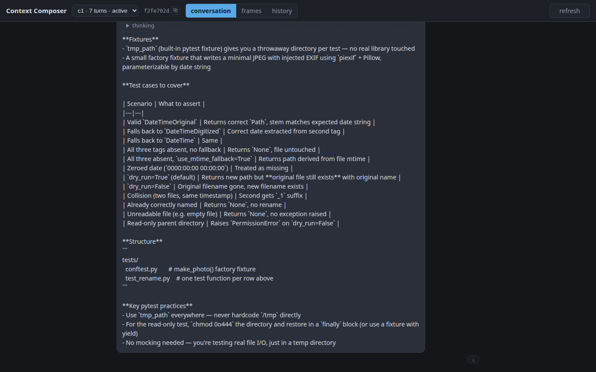
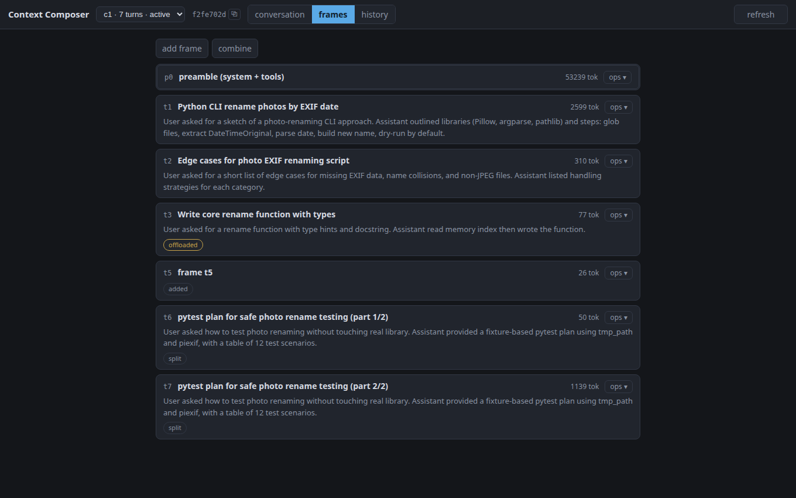
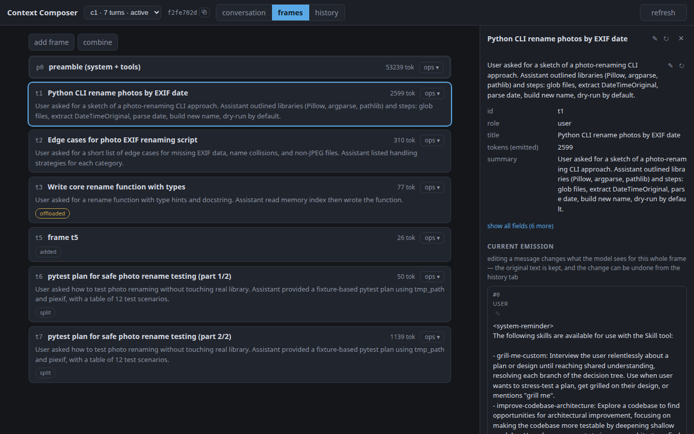
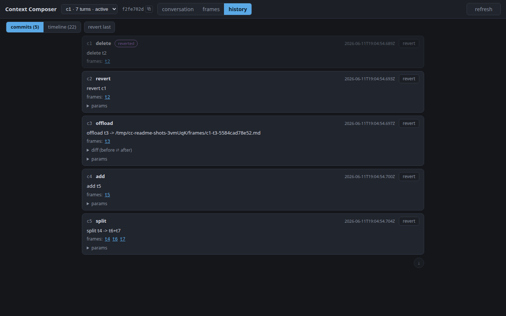
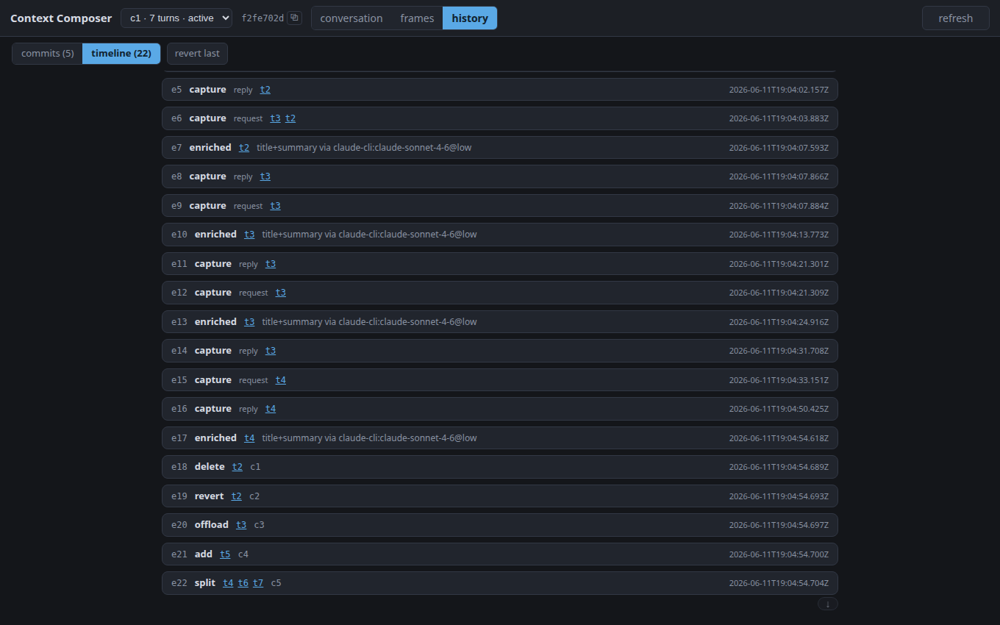

# Context Composer

> **Writeup:** [Context Composer: Editing Your Agent's Context Behind Its Back](https://nilmamano.com/blog/context-composer)

A proxy that turns a Claude Code session's context into **editable frames** —
delete, compact, offload, and reorder what the model sees, without the agent or
the model ever knowing. It sits between Claude Code and Anthropic's servers: you
see the raw text flowing through, and you get full control to edit it, from a CLI
or a browser UI. It's like doing brain surgery on your agent. See
[`design.md`](./design.md) for the full design and implementation plan.

## What it does

- **Transparent proxy** at the rendered-context boundary: byte-faithful
  passthrough for everything it doesn't understand; credential-agnostic (your
  subscription or API key rides through untouched).
- **Conversation registry**: Claude Code reuses the same connection for background
  requests (title generation, quota probes, next-message suggestions); each
  conversation gets its own frame store, identified by its first message after the
  system prompt — never guessed from content.
- **Frames**: each user message plus reply becomes one frame (with its whole tool
  loop bundled in); the system prompt + tools are a frame too — you can even delete
  it, though Anthropic's servers will likely reject the request.
- **Operations** — same verbs from the CLI and the UI, mechanically kept in
  parity: `delete`, `edit`, `compact`, `offload`/`restore`, `add`, `move`,
  `combine`, `split`, `drop-results`, `summarize-results`, `retitle`, `revert`.
- **History + audit**: every op is a commit (two-column diffs, click-to-revert);
  every wire event (request/reply captures, enrichment) is a timeline entry.
- **Auto titles/summaries** (opt-in): each captured turn gets an auto-generated
  title by a cheap model; frames re-title themselves once if their content
  materially grows; manual edits always win.
- **Wiretap**: an append-only JSONL of raw wire evidence for debugging/verifying.

## A tour of the UI

Every screenshot below comes from a **real Claude Code session** driven through
the proxy — a short conversation about building a photo-renaming CLI, followed
by a few ops. The whole thing is reproducible with one command:
`bun run scripts/capture-readme-shots.ts` (boots a throwaway daemon, drives the
session, runs the ops, photographs every view).

### Conversation view

The chat as the model currently sees it — different from what the Claude Code
client sees. Membership and order come from the engine's compose, so deleted
frames are gone and edited/offloaded frames show their current stand-in text.
Clicking a bubble opens the side panel with that frame's content and metadata.



### Frame view

The manipulation surface: one card per frame with its auto-generated title and
summary, token cost, and state chips (`offloaded`, `added`, `split`, …). Note
`t3` carrying its offload stub, the user-added note `t5`, and `t4` replaced by
its two split children with inherited "(part 1/2)" titles. Every card has an
ops menu; `add frame` and `combine` live in the toolbar.



### Details panel

Full content for one frame, explicit about *current emission* (what the model
sees next send) vs *source* (what the agent keeps resending). The title, the
description, and each plain-text message edit in place — with AI-regenerate
buttons beside the metadata fields.



### History — commits

Every operation is a commit with a before/after diff; any commit can be
reverted from its card (the `delete` + its `revert` at the top were part of
this session). `revert last` undoes the newest commit.



### History — timeline

The full audit trail: wire captures (request/reply), enrichment notes, and
every op — nothing happens to the context silently.



## Run

```bash
bun install
bun run ui:build     # build the browser UI into ui/dist (served by the daemon)
bun run proxy        # proxy + control API + UI on :8788
```

Point the wrapped agent at it, then drive frames from another shell or the browser:

```bash
ANTHROPIC_BASE_URL=http://localhost:8788 claude   # the wrapped agent (sub auth rides along)
open http://localhost:8788/ui                     # browser UI
bun run ctx list                                  # CLI: frames of the active conversation
bun run ctx conversations                         # all conversations (* = most recent activity)
bun run ctx delete t3
bun run ctx offload t2
bun run ctx revert
bun run ctx compose --dump
```

### Configuration (env)

| Variable | Purpose |
|---|---|
| `CC_PROXY_PORT` | proxy + control API + UI port (default `8788`) |
| `CC_CONTROL_URL` | where the CLI reaches the daemon (default `http://localhost:$CC_PROXY_PORT`) |
| `CC_UPSTREAM_URL` | upstream API base (default the real Anthropic API) |
| `CC_STORE_PATH` | durable JSON store (conversation registry snapshot) |
| `CC_WIRETAP_PATH` | append-only JSONL wire evidence |
| `CC_FRAMES_DIR` | offload artifact directory |
| `CC_LLM_CLAUDE_CLI=1` | LLM ops (`--regen`) via the local `claude` CLI (subscription, no API key) |
| `CC_CLAUDE_BIN` | path to the `claude` binary (when not on `PATH`) |
| `CC_LLM_CLI_MODEL` / `CC_LLM_CLI_TIMEOUT_MS` | regen-via-CLI overrides |
| `CC_LLM_API_KEY` / `CC_LLM_MODEL` / `CC_LLM_BASE_URL` | LLM ops via API key instead |
| `CC_ENRICH_ON_INGEST=1` | auto titles/summaries per captured turn (needs an LLM provider above) |
| `CC_ENRICH_MODEL` / `CC_ENRICH_EFFORT` | enrichment model/effort (default `claude-sonnet-4-6` @ `low`) |

Defaults burn nothing: without the explicit LLM/enrichment gates, no API calls,
no subscription use, no network beyond the proxied agent traffic itself.

## Test

```bash
bun run typecheck    # tsc, root + ui
bun test             # full suite — stub upstream, no quota, no network
bun run ui:smoke     # real-browser gate (Playwright) against a committed fixture
bun run demo         # scripted phase-1 walkthrough against the stub
```

Live gates (real model, human-attended; subscription auth — no API keys):

```bash
bash scripts/live-e2e.sh      # delete flips what the live model can recall
bash scripts/live-phase2.sh   # durability + revert across real daemon restarts
```

## Live-agent smoke (subscription auth — no API keys)

The live run drives a real Claude Code through the proxy using the existing
**Claude subscription session** — **no API key, ever**. The proxy is
credential-agnostic: it forwards whatever auth headers the agent attaches,
untouched. The only wiring is `ANTHROPIC_BASE_URL`:

```bash
bun run proxy                                     # terminal 1
ANTHROPIC_BASE_URL=http://localhost:8788 claude   # terminal 2: real convo
bun run ctx list                                  # terminal 3: real frames; delete one; watch the next turn
```

Run it with the human in the loop before claiming demo readiness; the stub-driven
suite above is the engineering gate.
