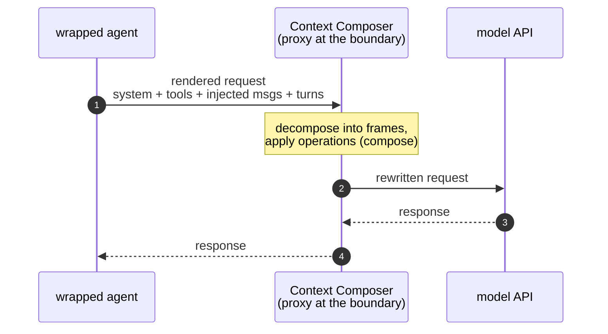
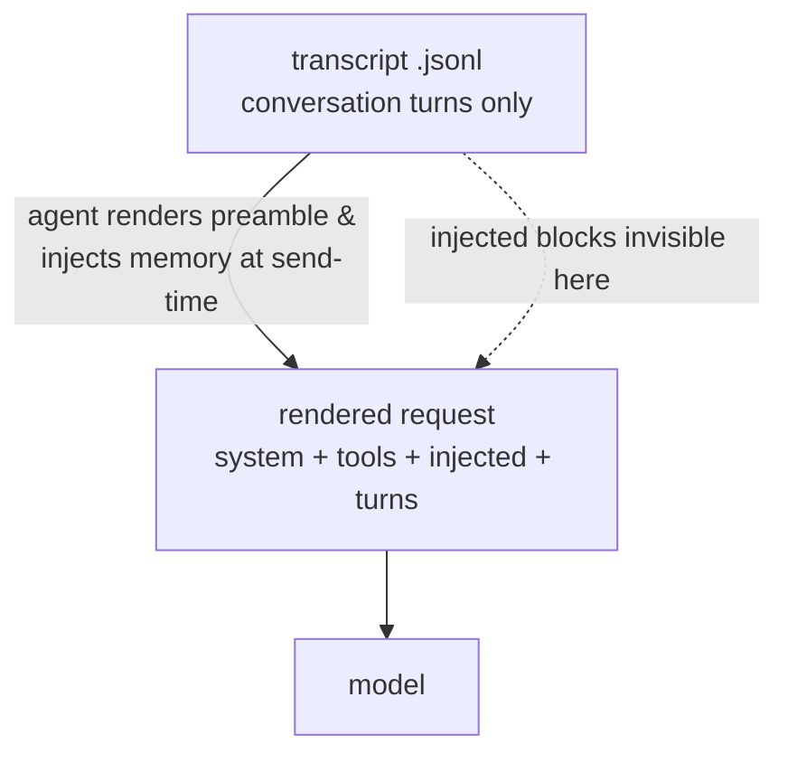

# Context Composer — Design Document

## 1. Summary

**Context Composer** reimagines LLM context as a sequence of composable **semantic
frames** rather than a flat, append-only token stream. Instead of accepting whatever
accumulates in the window during a conversation, the user (or an agent) can
**surgically manipulate** that context: delete tangents, compact stale turns, strip
noisy tool output, combine related turns, branch, and offload to external memory —
all while a real LLM keeps running the conversation against the mutated state.

Three properties define the system:

1. **Frames** — the context is segmented into semantic units you can address and operate on.
2. **A rich operation toolkit** — not just "compact the whole thing," but a broad set of targeted operations on individual frames or groups.
3. **Git-style versioning** — every operation is a commit; full history, rollback, and branching apply to *context itself*.

The deliverable is a **portfolio demo** that makes the paradigm tangible and starts a
conversation about context architecture. Practicality matters only insofar as the
mechanism is *theoretically grounded* (see [§9](#9-provider-assumptions--constraints)).

### 1.1 Positioning (the one-line identity)

The core, differentiating idea is **live, in-conversation, model-unaware surgery on
the active working window at the turn/frame level.** The running model never sees the
operations — only the resulting context. This is context engineering performed
*during* a task on the *live* window, distinct from tools that assemble and version a
persistent knowledge/memory base *before/around* a task.

**North-star use case (locked).** A developer runs their *real, interactive Claude Code
session* in one terminal pointed at the Composer proxy, and from a second terminal
performs live surgery on that session's working context — delete a tangent, offload a
file dump, revert a bad turn — while the agent keeps working, **unaware**. The abstract
design stays agent-neutral (any runtime satisfying
[§9](#9-provider-assumptions--constraints)), but this real-TUI experience is the hero
target the implementation builds toward.

---

## 2. Core Concepts

### 2.1 Frame

A **frame** is a semantic unit of conversation — the addressable object the whole
system operates on.

- **Default extraction:** each user turn and its corresponding assistant turn form a
  frame. **All of the assistant turn's tool calls and their results are bundled into
  the same frame** — tool calls are *not* their own frames.
  *(Rationale: splitting on tool-call boundaries produces meaningless fragments — e.g.
  a 3-word "and now let me check this repo" frame wedged between two tool calls.
  Keeping the assistant turn whole keeps frames semantically coherent. Nesting
  frames-within-frames is rejected: the model is **flattened**.)*
- **Granularity is a starting point, not a commitment.** Rather than trying to get
  boundaries perfect upfront, the system gives you operations (`combine`, `split`) to
  reshape frames after the fact. This is the central design bet.
- Each frame carries: an **auto-generated title**, an **auto-generated summary** (for
  scanning in frame view), the **full text**, and metadata (see [§7](#7-data-model)).
- **Sub-agent calls** are treated exactly like tool calls: the assistant invokes a
  sub-agent, gets a result back within its turn, and it all stays in the same frame.
  Sub-agents are *not* separate conversation trees.
- **Large pasted blobs are not auto-split.** A big file pasted into a turn stays inside
  that turn's frame; the user reshapes it on demand with `split` or `offload`. This
  keeps extraction dumb-and-simple and is consistent with the reshape-after-the-fact bet
  above — no size heuristics at creation time.
- **The system prompt is itself a frame** — captured like any other, no special type.
  See [§2.7](#27-everything-the-model-receives-is-a-frame).

### 2.2 Operation

An **operation** is a transformation applied to one or more frames (or to the branch
structure). Operations are the heart of the product — see the exhaustive catalog in
[§5](#5-operation-catalog-the-core).

### 2.3 Git-style versioning

Every mutating operation is a **commit**. The system keeps the full revision history
of the context, enabling rollback to any prior state, branching from any point, and
cherry-picking frames across branches and conversations. Context is treated like a
Git repository whose "files" are frames.

### 2.4 Branching

Context can fork into a tree of branches from any frame. Two semantics are supported,
chosen per operation:

- **Shared-ancestor frames** — an operation on a shared frame ripples forward to all
  descendant branches.
- **Isolated frames** — branch-specific; changes don't affect other branches.

So when you operate on a past frame, **you choose per operation** whether the change
ripples forward to descendant branches.

Two related scope boundaries:
- **No git-style branch merge.** Combining two *frames* is
  [`combine`](#5b-structural-operations); combining two *branch histories* is out of
  scope (see [future work](#10-future-work)).
- **Cross-branch combination is only via explicit `import`** — see
  [§5.F](#5f-composition--runtime). Branches are isolated timelines; `import`
  (cherry-pick) is the single bridge between them.

### 2.5 External memory

Frames are **always persisted durably** the moment they're created (for session
resume — same as Isomux saving every message). Separately, an explicit **offload**
operation swaps a frame's full text *in the active context* for a **summary + file
reference**, freeing window space while keeping the content reachable on demand. The
data already exists in storage; offload only changes how the frame is *represented* in
the working context.

**Retrieval needs no special mechanism.** The offload stub carries the
file path, and — assuming the agent has a file-read tool ([§9](#9-provider-assumptions--constraints)) —
the model simply **reads the file** when it needs the content; no custom fetch tool, no
heuristic intent-detection. When it does, the content re-enters the conversation as a
normal **file-read tool-result frame**, which is itself a fully manageable frame (you
can re-`offload`/`compact` it). A user-facing `restore` exists only as a convenience for
putting content back inline without a model round-trip.

### 2.6 The model is unaware (key principle)

When the user performs an operation, the **running LLM does not see the operation** —
it only ever sees the resulting mutated context. From the model's perspective, the
context simply *is* whatever it now is. The operation history is **metadata for the
user, not signal for the model.** ("We're doing surgery on its brain; it doesn't know
what's going on.")

### 2.7 Everything the model receives is a frame

There are **no frame types.** Every frame is uniform and supports the same operations; a
frame is just an addressable chunk of context. What it *holds* varies — a conversation
turn, the system prompt, a block of tool definitions, a chunk of agent-injected memory —
but none of those are special classes.

Frames cover the **entire context the model receives**, not only the conversation. The
non-conversational preamble — system prompt, tool definitions, and **anything the agent
injects** (project instructions, retrieved memory, …) — is captured as frame(s) at the
head of the list. Turns are frames; the preamble is frames; it is all one uniform list.

**Total control, by capture — not by constraint.** Context Composer is *unopinionated
about what enters* the context: it does not seal, disable, or restrict the agent's
injectors. It captures **everything the model actually receives** as frames and lets you
manipulate any of it — keep, compact, edit, offload, or delete. *"What's necessary and
nothing but that"* is achieved by your surgery on the complete realized context, not by
policing its sources. (Same reshape-after-the-fact bet as [§2.1](#21-frame), applied to
provenance.)

A preamble frame is **just a frame** — no pinning, no guard rails. You can compact it,
offload it (a strong demo beat — live token reclamation), or delete it outright; deleting
it strips the model's scaffolding, and that is your call to make, not the tool's.
Capturing the complete realized context requires observing it at the right layer — see
[§9](#9-provider-assumptions--constraints) and
[Appendix B](#appendix-b--reference-implementation-notes).

---

## 3. Architecture: CLI-first, UI as a thin wrapper

The **CLI is the core API**; the UI is a wrapper that calls the same commands. This
keeps logic decoupled from presentation, makes every operation scriptable and
testable independently, and means the UI can never do something the CLI can't.

```
┌──────────────────────────────┐      ┌──────────────────────────────┐
│            UI                │      │       External scripts        │
│  (conversation ⇄ frame view) │      │      / agents / tests         │
└───────────────┬──────────────┘      └───────────────┬──────────────┘
                │  invokes                              │  invokes
                ▼                                       ▼
        ┌───────────────────────────────────────────────────┐
        │            ctx CLI  (core operation API)           │
        │  list · show · add · delete · combine · split     │
        │  edit · compact · strip · summarize · offload     │
        │  restore · import · branch · checkout · revert    │
        │  tag · history · diff · status · compose · send    │
        └───────────────────────┬───────────────────────────┘
                                 ▼
        ┌───────────────────────────────────────────────────┐
        │  Engine: frame store · commit graph · composer     │
        └───────────────────────┬───────────────────────────┘
                                 ▼
        ┌──────────────────────┐   ┌──────────────────────────┐
        │  Durable frame store  │   │  LLM / agent runtime     │
        │  + external memory    │   │  (see §9 assumptions)    │
        └──────────────────────┘   └──────────────────────────┘
```

Each CLI command emits JSON (machine-readable for the UI/scripts) or plain text.

> **Implementation note (not design surface):** the reference prototype realizes the
> backend by wrapping an existing coding agent — Claude Code, driven via its SDK. It
> manages the message history the agent sees and reuses the agent's **native
> facilities** rather than reimplementing them: tools, sub-agents (its Task tool),
> permissions, and the file-read tool that powers offload retrieval
> ([§5.D](#5d-memory-operations)). This is an implementation choice, not part of the
> design — any runtime satisfying the assumptions in
> [§9](#9-provider-assumptions--constraints) would work. See
> [Appendix B](#appendix-b--reference-implementation-notes) for how the prototype owns
> and mutates that history.

---

## 4. Two views

A single conversation is presented through two interchangeable views, toggled at any time.

- **Conversation view** — standard ChatGPT-style chat. This is where you *talk to the
  model*. Questions the model asks, tool calls, etc., pass through as plain text/turns
  (no special permission or question widgets — see [§9](#9-provider-assumptions--constraints)).
- **Frame view** — the manipulation surface. Frames are shown as a **Git-style tree**:
  nodes are frame states (title + summary), edges are the operations that transformed
  them. You expand a node for full text, right-click for the operation menu, drag to
  branch. A side panel shows the operation/commit history and filters by type.

---

## 5. Operation Catalog (the core)

This is the exhaustive list of operations. They fall into six groups:

- **A. Read / navigation** — non-mutating; no commit.
- **B. Structural** — change the *set/order* of frames; each is a commit.
- **C. Content** — change a frame's *contents*; each is a commit.
- **D. Memory** — move content between active context and external storage.
- **E. Version control** — operate on the commit graph / branches.
- **F. Composition / runtime** — assemble and send context to the model.

> **Commit rule:** every operation in groups B, C, D (and the structural VC ops in E)
> produces a commit `{ id, type, affectedFrameIds, params, timestamp, note }`.
> Group A produces none. Composition ([§5.F](#5f-composition--runtime)) is
> non-mutating to history but determines what the model receives.

### Quick reference

| Op | Group | One-liner |
|---|---|---|
| `list` | A | List frames in the current state |
| `show` | A | Show a frame's full content |
| `history` | A | Show the commit log |
| `diff` | A | Compare two frames/commits/branches |
| `status` | A | Active branch, HEAD, pending state |
| `add` | B | Create a new frame manually |
| `delete` | B | Remove a frame from active context |
| `combine` | B | Merge ≥2 frames into one |
| `split` | B | Split one frame into several |
| `move` | B | Reorder a frame in the sequence |
| `import` | B | Cherry-pick a frame from another branch/conversation |
| `edit` | C | Manually replace a frame's text |
| `compact` | C | LLM-summarize a whole frame to cut tokens |
| `strip` | C | Remove specific tool-call results inside a frame |
| `summarize` | C | LLM-summarize tool results / sub-parts inside a frame |
| `retitle` | C | (Re)generate or set a frame's title/summary |
| `offload` | D | Swap full text for summary + file reference |
| `restore` | D | Re-inject an offloaded frame's full text |
| `branch` | E | Create a branch from a frame/commit |
| `checkout` | E | Move HEAD to a branch or commit |
| `revert` | E | Roll back to a previous commit |
| `tag` | E | Name a checkpoint state (optional) |
| `compose` | F | Build the exact context payload for the next call |
| `send` | F | Run the next model turn against composed context |

---

### 5.A Read / navigation (non-mutating)

**`list`** — List all frames in the current branch state, with index, id, title, token
estimate, and flags (offloaded?, edited?, compacted?). The scan view for frame mode.

**`show <frame>`** — Display a single frame's full text, summary, and metadata
(linked tool calls, file reference if offloaded, provenance).

**`history [--frame <id>] [--type <op>]`** — Show the commit log: every operation,
its type, affected frames, timestamp, note. Filterable by frame or operation type.

**`diff <a> <b>`** — Compare two states: two commits, two branches, or a frame before
and after an operation. Powers the side-by-side previews in frame view.

**`status`** — Current branch, HEAD commit, current frame position, count of
offloaded frames, and any uncommitted/pending changes.

---

### 5.B Structural operations

**`add [--text <t>] [--at <pos>]`** — Manually create a new frame, either from pasted
text or empty for editing. Use cases: inject an instruction/note, seed context, or
paste content the conversation didn't produce.

**`delete <frame...>`** — Remove one or more frames from the active context. The
canonical use case: prune a tangent so the model stops attending to noise. The frame
remains in durable storage and history (recoverable via `revert`); it's just no longer
in the composed window.

**`combine <frame...> [--summarize]`** — Merge multiple frames into a single frame.
Canonical use case: collapse five iterations of a code file into one "previous
attempts" frame (optionally `--summarize` to compact while merging). Reduces
fragmentation and the model's burden of tracking which version is current.

**`split <frame> --at <marker|index>`** — Split one frame into several. The inverse of
`combine`; lets you separate out a sub-part you want to manipulate independently
(e.g., peel a distinct topic off a long turn).

**`move <frame> --to <pos>`** — Reorder a frame within the sequence ("rearrange
blocks"). Note the caching cost (see [§9](#9-provider-assumptions--constraints)):
moving early frames invalidates the tail.

**`import <source> <frame...>`** — Cherry-pick frames from **another conversation or
branch** into the current branch. The Git analogy made literal: cross-repo cherry-pick
for context. Source can be another session, a sub-agent branch, or a search across all
conversations.

---

### 5.C Content operations

**`edit <frame> [--text <t>]`** — Manually replace or modify a frame's text, giving
the user full authorship over what the model sees. Tracked as an `edit` commit.
*Semantics:* editing keeps `createdAt` **immutable** (it marks when the
frame entered the conversation — relevant to ordering and caching) and bumps
`modifiedAt`; it is **non-destructive downstream** — later frames are not regenerated,
only what the next `compose`/`send` uses changes (the cache cost is paid at next
`send`). Diffs render as a standard text diff (`fullText` before vs after) in the
history panel. *(UX nudge: prefer editing recent frames — see
[§9](#9-provider-assumptions--constraints).)*

**`compact <frame>`** — Use the LLM to **summarize an entire frame** down to its
essence ("user asked X, assistant explained Y") while preserving its semantic
contribution. This is *frame-level compaction* — the key insight that compaction
should be granular and targeted, not an all-or-nothing operation on the whole window.

**`strip <frame> [--result <id...>|--all-results]`** — Remove specific tool-call
**results** inside a frame without deleting the frame. Canonical use case: an assistant
turn made three API calls with long outputs; keep the reasoning, drop the raw output
bloat.

**`summarize <frame> [--results|--range ...]`** — LLM-summarize a *part* of a frame
(e.g., compress long tool results in place) rather than the whole frame. The
finer-grained sibling of `compact`/`strip`.

**`retitle <frame> [--title <t>] [--summary <s>] [--regen]`** — Set or regenerate a
frame's title/summary. Titles/summaries are auto-generated on creation; this lets the
user correct them or refresh after edits.

> **Why so many content ops?** There isn't a single `compact` primitive — there's a
> *rich toolkit* for reshaping the part of the context you care about. `compact`,
> `strip`, `summarize`, `edit`, `combine`, `split` are all facets of "reshape this
> region of context to be exactly as useful as it needs to be."

---

### 5.D Memory operations

**`offload <frame>`** — Replace a frame's full text *in the active context* with a
**reference**: a short note ("here was a chunk where the user discussed X — summary:
…; full content in `frames/<id>.md`") plus the file path. Frees window tokens while
keeping content reachable. *(The frame's data is already persisted; offload only
changes its representation in the working context. It is opt-in / on-demand, not
automatic.)* The model retrieves it on demand by **reading the file with its file-read
tool** — the stub gives it the path. No custom fetch tool, no intent-guessing.

**`restore <frame>`** — Re-inject a previously offloaded frame's full text inline. This
is a **user convenience only**; the *model* doesn't need it, since it can just read the
offloaded file directly. Note that when the model reads an offloaded file, the content
re-enters the conversation as a normal **file-read tool-result frame** — itself a fully
manageable frame you can re-`offload`/`compact`.

**`persist` (automatic, not a user command)** — Every frame is written to durable
storage on creation (and recorded as a `capture` event in the [timeline](#7-data-model)),
so a user can close the tab and resume later. This underpins both session resume and the
offload/restore mechanism (offload is cheap precisely because the data is already saved).
Capture persists and is auditable, but it is **not** a commit — it doesn't enter the
revertible `history`.

---

### 5.E Version-control operations

**`commit` (implicit)** — Every mutating operation records a commit
`{ id, type, affectedFrameIds, params, timestamp, note }`. There is no separate manual
commit step in the default flow; the operation *is* the commit. Separately, **every** store
mutation — operations **and** raw turn capture — appends a `ContextEvent` to the complete
audit **timeline** ([§7](#7-data-model)). Two read surfaces fall out: **`history`** = the
commit log (what *you* did to the context; revertible/branchable), and **`timeline`** = the
full ordered record including captures. Capture is a timeline event only — never a commit
(see [Appendix C](#appendix-c--reconciliation-across-operations)).

**`branch <name> [--from <frame|commit>]`** — Fork a new branch from any frame or
commit. Use cases: explore an alternative direction while keeping the original intact;
test prompt/strategy variations side by side.

**`checkout <branch|commit>`** — Move HEAD to a branch or a past commit, switching the
active context to that state.

> **No branch `merge` (out of scope).** Git-style branch merging — combining two
> *histories* with conflict resolution when shared-ancestor frames diverge — is
> deferred to [future work](#10-future-work). Merging two *frames* is
> [`combine`](#5b-structural-operations); pulling frames across branches is
> [`import`](#5b-structural-operations).

**`revert <commit>`** — Roll the active context back to a previous commit state.
Nothing is lost — you can move forward again or branch from the reverted point.

**`tag <name> [--at <commit>]`** *(optional)* — Name a checkpoint for easy reference
("good-baseline", "pre-refactor").

---

### 5.F Composition / runtime

**`compose [--branch <b>]`** — Build the **exact context payload** that will be sent
to the model, by walking the active branch path to HEAD and resolving every frame's
current representation: deletions omitted, compactions/edits applied, offloaded frames
rendered as references. This is where the abstract frame graph becomes a concrete
prompt. Output is inspectable (you can see precisely what the model will receive).

- **Branch selection:** `compose` **always walks a single branch path**
  to HEAD. Cross-branch combination is done *only* via explicit
  [`import`](#5b-structural-operations)/cherry-pick (a real commit) — never by composing
  across branches. This keeps provenance honest (everything in the payload literally
  exists on the active branch) and preserves the model-unaware principle. Native
  multi-branch compose is [future work](#10-future-work).
- **Wire-integrity sweep (load-bearing).** Because frames can be freely edited, deleted,
  reordered, combined, or split, the resolved payload can end up structurally **invalid for
  the provider**. `compose` must emit a provider-valid request **unconditionally**: drop an
  orphaned `tool_use` whose paired `tool_result` was removed (and vice-versa — the firm
  Anthropic pairing constraint), and repair role-ordering artifacts a deletion can create
  (a leading assistant turn; a dangling assistant reply whose user turn was deleted;
  illegal same-role runs). This is the *single* place that guarantees validity, so no
  individual operation needs guard rails — consistent with **total control by capture, not
  constraint**: the user may mutate frames into any intermediate state, and `compose`
  quietly renders something the API will accept. Required **regardless of frame
  granularity** (it's not a consequence of bundling vs. splitting turns).

**`send [--text <t>]`** — Issue the next model turn: `compose` the context, append the
new user input, hand it to the backend, and capture the response as a new frame. The
model sees only the composed (mutated) state — never the operation history.

---

## 6. Worked use cases

1. **Tangent pruning.** You wander off-topic. Switch to frame view, `delete` the
   tangent frames. The next turn flows cleaner; the model never re-reads the noise.
2. **Code iteration cleanup.** Five versions of a file sit in context. `combine` the
   old ones into a "previous attempts" frame, optionally `compact` it. Context now
   holds the current version + a pointer to what was tried.
3. **Tool-call spam.** An assistant turn made three calls with huge outputs. `strip`
   two results and `summarize` the third; reasoning stays, bloat goes.
4. **Branch to explore.** `branch` from an earlier frame, try a different direction,
   keep the original. Later `import` the best frames from one branch back into another.
5. **Offload to external memory.** A big but maybe-needed frame: `offload` it to a
   file; the window keeps a summary + path; the model reads the file with its native
   tool if it needs the detail (or you `restore` it manually).
6. **Cross-conversation reuse.** Found a great explanation in another chat? `import`
   that frame into the current branch — cherry-pick across "repos."

---

## 7. Data Model

```
Frame {
  id            : string
  title         : string          // auto-generated, user-overridable
  summary       : string          // auto-generated, for frame-view scanning
  fullText      : string
  role          : "user" | "assistant" | "system" | "imported"
  toolCalls     : ToolCall[]      // bundled with the assistant turn; flattened
  tokenEstimate : int
  createdAt     : timestamp
  modifiedAt    : timestamp
  branchId      : string
  parentFrameId : string | null
  isOffloaded   : bool
  fileReference : string | null   // path when offloaded
  provenance    : OpRef[]         // operations that produced this frame's representation
  createdEventId : string | null  // the capture event that first created this frame
                                  // (timeline origin; NOT a representation override — Appendix C)
}

ContextEvent /* the complete, append-only audit timeline */ {
  id        : string
  type      : "capture" | <operation type>   // EVERY store mutation; captures included
  frameIds  : string[]                        // frames created / affected
  commitId  : string | null                   // set iff this event also produced a Commit
  timestamp : timestamp
}

Operation /* = Commit (the revertible subset of events) */ {
  id              : string
  type            : "add" | "delete" | "combine" | "split" | "move" |
                    "import" | "edit" | "compact" | "strip" | "summarize" |
                    "retitle" | "offload" | "restore" | "branch" |
                    "checkout" | "revert" | "tag"
  affectedFrameIds: string[]
  params          : object        // op-specific (e.g., split marker, summarize range)
  timestamp       : timestamp
  note            : string | null
  branchId        : string
  parentCommitId  : string | null
}
// Event vs Commit (see Appendix C). An **Event** records that *something happened to the
// context store* — raw turn capture (source material arriving) AND every user operation.
// A **Commit** is the *intentional, representation-changing* subset, carrying version-
// control semantics (revert / branch / checkout). The commit graph is a projection over
// the event log: `timeline` reads events; `history` reads commits. Raw capture is an event
// only — never a commit, and never enters `Frame.provenance` (it is not a representation
// override, so refresh-gating still keys on representation, not on existence).

Branch {
  id            : string
  name          : string
  headCommitId  : string
  parentBranchId: string | null
  createdAt     : timestamp
}

Session {
  id              : string
  activeBranchId  : string
  headFramePos    : int
  externalMemRefs : string[]
  pendingChanges  : bool
}
```

---

## 8. UI Architecture

- **Dual view** with a toggle: conversation view ⇄ frame view.
- **Frame view = Git-style tree.** Nodes = frame states (title + summary, color-coded
  by branch); edges = operations (labeled with op type). Click a node → expand full
  text; right-click → operation menu; drag → create a branch.
- **Preamble frame(s)** at the head of the tree (system prompt / tool definitions /
  agent-injected context) — operable like any other frame, `delete` included.
- **Frame details panel** — full text with inline edit, summary, linked tool calls,
  file reference if offloaded, and provenance.
- **Operation/history panel** — the commit log with filtering and side-by-side diffs;
  click a commit to `checkout`/`revert`.
- **Tree visualization** — start minimal (hand-drawn SVG nodes/edges) for control and
  cleanliness; graduate to Cytoscape.js / Vis.js if the tree gets large. For a demo,
  minimal usually looks cleaner than a heavy library.

---

## 9. Provider assumptions & constraints

**Assumptions about the LLM backend:**

1. Messages have a standard structure: user / assistant (with optional tool calls and
   results) / system.
2. Tool calls are discrete, inspectable units within an assistant message — not opaque
   blobs. *If this holds*, tool calls are first-class within frames (enabling `strip`
   / `summarize` on individual results); *if not*, they degrade gracefully to plain
   text.
3. The API supports **editing an earlier message and re-running from that point** —
   which Claude and ChatGPT both already do. Context Composer's frame editing is just
   leveraging this existing capability; it asks for **nothing new** from the provider.
4. The full message structure is readable, not just rendered text.
5. The agent has a **file-reading tool**, so an offloaded frame can be retrieved by the
   model simply reading its file on demand ([§5.D](#5d-memory-operations)) — no bespoke
   fetch mechanism needed.
6. The **system prompt is composable** by the harness (not a fixed opaque preamble), so
   it can be represented and operated on as a frame
   ([§2.7](#27-everything-the-model-receives-is-a-frame)).
7. The **complete rendered context can be observed and rewritten before each call** —
   every block the model actually receives (system, tools, agent-injected content, and
   the conversation), not just the transcript. This is what makes total control
   ([§2.7](#27-everything-the-model-receives-is-a-frame)) achievable; see
   [Appendix B](#appendix-b--reference-implementation-notes).

**Caching / efficiency:**

- Editing a frame keeps everything **before** it cached (prefix caching) but
  **re-tokenizes everything after** it. So edits near the *end* of the context are
  cheap; edits to *early* frames invalidate the tail.
- **UX consequence:** nudge users to edit/operate on **recent** frames and let early
  frames "settle" into stable context. Keep the tail hot, the head stable.
- **Composer cache duties (it owns the exact request bytes — see
  [Appendix B](#appendix-b--reference-implementation-notes)):** (a) serialize unchanged
  frames **deterministically** — identical bytes and key order every turn — so it never
  busts the cache by accident; (b) keep the provider's cache-prefix markers (e.g.
  `cache_control`) on the **stable head**, above the large tool + system block, so that
  high-value prefix is cache-read rather than reprocessed each turn.
- For a demo, full re-tokenization on each mutation is acceptable and honest — nobody
  is watching inference cost. The pitch is "here's the UX we want; here's how a
  provider *could* support it efficiently," not "we solved the infra."

**Scope simplifications (demo):**

- **No permission system.** Run with permissions effectively skipped
  (`--dangerously-skip-permissions`-style). Optionally a single global "ask before
  tool calls" toggle, but no full permission UI.
- **No special question/planning widgets.** If the model asks the user something, it
  appears as plain text in conversation view; the user answers as the next turn. No
  bespoke interaction UI — this avoids the "adapter hell" of replicating every native
  agent feature.

---

## 10. Future work

- **Smarter frame extraction.** Use the LLM to detect true semantic boundaries and
  auto-merge/split, instead of the default turn-based segmentation.
- **Cross-branch composition** as a first-class compose mode.
- **Git-style branch merge** with frame-level conflict resolution.
- **Auto-restore on detected intent** — heuristically re-inject an offloaded frame when
  the model's output implies it's needed.
- **Collaboration.** Shared contexts, visible operation history, suggested operations,
  rollback by others.
- **Agentic operations.** The model itself proposes operations ("this tangent should
  be compacted") that the user accepts/rejects — surfacing agentic reasoning *about
  context*. A strong demo beat.
- **Deeper feature parity** with native agent systems (planning, permissions) once the
  core is stable.

---

## 11. Implementation Plan

Tracer-bullet sequencing: each phase is the smallest end-to-end slice that produces
observable behavior, smallest first — no horizontal layers (no "build all the ops, then
build the UI"). Tech stack is TypeScript end-to-end on Bun to match the Isomux codebase
(proxy/engine + CLI + React UI).

### Decisions (open questions, answered with current leaning)

- **Storage substrate → JSON-on-disk**, with deterministic *canonical* serialization
  from birth (one serializer feeds both the cache story and the store). SQLite is
  deferred to a later optimization only if history queries get annoying.
- **Process model → long-lived proxy daemon** that holds the authoritative frame state,
  exposing a small local control API the CLI calls. The CLI mutates the same live state
  the proxy uses for the next request — it does **not** coordinate with the proxy through
  disk alone.
- **Multi-turn tool-loop validation → carried explicitly by Phase 1**, not deferred to a
  separate spike (the boundary spike validated a single rewrite, not the full loop).
- **Frame granularity → one frame = the user message + the agent's response (with its
  tool loop), bundled.** Settled (was open): separating the human and assistant turns into
  distinct frames was considered and rejected — it would push tool-pairing and
  role-ordering integrity onto `compose` without net simplification, and fragment one
  logical tool loop into many frames. Bundling keeps the addressable unit a self-contained
  exchange; `split` stays the on-demand escape hatch for finer control. *Note:* free
  editing makes a compose-time **integrity sweep** (drop orphaned `tool_use`/`tool_result`,
  the firm Anthropic pairing constraint) load-bearing **regardless** of granularity — it
  lands with the `edit` op in Phase 3.
- **Genuinely uncertain:** whether shared-vs-isolated *ripple* is needed for the demo.
  The locked decision is *single-branch compose*, not full ripple — so ripple is split
  out and gated (Phase 4b).

### Standing gate — real-TUI smoke after every deliverable

Every deliverable closes with a **real interactive TUI smoke** in addition to its
unit/integration tests and the scripted live gates (`live-e2e.sh`, `live-phase2.sh`).
The scripted `-p` harness does not exercise what the interactive TUI does — side-query
multiplexing (title/recap/quota/suggestion traffic), re-encoding across resends,
permission-gated tool loops, streaming behavior — and every major live finding to date
(the §11 Phase 2.6 fidelity defects, the Phase 2.7 fork leak) was surfaced by a real
session, not by tests.

The smoke is **agent-drivable** — it does not require a human at a terminal (proven
during Phase 2.7 validation):

- Run the wrapped agent's real interactive TUI inside a `tmux` session
  (`send-keys` to drive it, `capture-pane` to read it), with **real auth against the
  real provider** — never a stub.
- Point it at a **fresh proxy instance on its own port + store + wiretap paths**; never
  reuse or clobber a live daemon's state.
- **Never blanket-bypass the agent's permission gates** (no `bypassPermissions`):
  run the TUI in its default permission mode and approve prompts interactively,
  per-action, as they appear in the pane.
- Exercise at least: a multi-turn exchange, a tool-use turn, whatever surface the
  deliverable changed, and a `ctx` mutation (e.g. `delete`) reflected on the next turn.
- **Judge via the wiretap, not the pane**: the per-request evidence
  (`viewFrameIds`/`omittedFrameIds`, `wireWarnings`, upstream status, exact bodies) is
  the acceptance record; the pane only shows that the session stayed healthy.

A bonus property observed twice: the TUI's organic side traffic (e.g. spontaneous
suggestion-mode queries) reproduces the exact shapes the phases are built against —
prefer waiting for the real shape over synthesizing it (the "test, don't pre-engineer"
rule lives or dies on this gate).

### Phase 1 — Tracer bullet: prove the engine loop end-to-end

- **Goal:** one rewritten request round-trips the full loop with a `delete` applied,
  reconciliation working, and a byte-stable head.
- **Vertical slice:** proxy daemon at the rendered-context boundary (`ANTHROPIC_BASE_URL`)
  captures `/v1/messages` → decompose into preamble frame(s) + turn frames → reconcile the
  incoming request against the authoritative in-memory frame state (match known frames,
  append new ones) → CLI `list`/`show`/`delete` mutates that live state via the control
  API → `compose` walks frame state → canonical serializer rewrites the body
  (`cache_control` on the stable head) → forward → capture response as a new frame.
- **Files/modules:** `proxy/` (http daemon + control API), `engine/decompose`,
  `engine/reconcile`, `engine/compose`, `engine/serialize` (canonical), `engine/state`
  (in-memory), `cli/` (`list`/`show`/`delete`/`compose` + control-API client). `compose`
  exposes `--dump` (print the resolved payload) and `--hash-head` (print a hash of the
  serialized stable head) so determinism is checkable, not eyeballed.
- **Acceptance:**
  - Point the wrapped agent at the proxy; one prompt yields a captured request and
    `ctx list` shows preamble + turn frames.
  - `ctx delete <frame>`; the next turn's rewritten request omits it and the model's
    answer reflects the mutated context (model unaware).
  - **Reconciliation:** a second user turn after the delete **plus at least one
    tool_use/tool_result round-trip** — known frames are matched, new frames appended, the
    deleted frame stays gone when recomposed.
  - **Inspectable compose:** `ctx compose --dump` prints the exact payload the next send
    will use (deletions omitted) — this is the inspection command later phases rely on, so
    every "compose shows X" acceptance downstream is observable.
  - **Determinism:** across two consecutive sends with no head change, `ctx compose
    --hash-head` prints the **same hash** both times (byte-identical stable head) and the
    dumped payload still carries the `cache_control` marker on that head.
- **Risks/unknowns:** frame identity/reconciliation across turns is the crux of full
  ownership (the general mechanism — source identity vs. representation — is
  [Appendix C](#appendix-c--reconciliation-across-operations); Phase 1 builds its
  single-source/full-or-deleted special case); streaming responses are SSE passthrough;
  the tool-loop under full ownership is the remaining load-bearing unknown this phase
  exists to de-risk.
- **Size:** M (the load-bearing phase — budget accordingly).

### Phase 2 — Versioning spine (narrow vertical slice)

- **Goal:** every mutating op is a durable, inspectable, undoable commit — for the tracer
  ops only — recorded on a complete audit timeline.
- **Vertical slice:** persist frame state + **event log** + commit graph to JSON-on-disk
  (the canonical form from Phase 1); record an implicit commit when a **user mutating op**
  (`delete`) happens; wire `history`, `timeline`, and `revert`. Frame **capture** of new
  turns appends a `capture` **event** (the automatic `persist` of §5.D — written for resume
  and visible on the timeline), but is **not** a commit — so the §5/§7 *commit* enum stays
  intact and `history` shows only user operations while `timeline` shows the full
  chronology (captures included). The commit graph is the revertible projection over the
  event log; a `delete`/`revert` event carries the `commitId` it produced.
- **Files/modules:** `engine/store` (json-on-disk), `engine/event-log`,
  `engine/commit-graph`, `cli/` (`history`, `timeline`, `revert`),
  `engine/state` (durable-backed).
- **Acceptance:** restart the proxy/CLI → `ctx list` shows the persisted frames →
  `ctx delete` one → `ctx history` shows the implicit commit (and `ctx timeline` shows
  capture + delete) → `ctx revert` restores it → the next rewritten request reflects the
  reverted state.
- **Scope guard (anti-horizontal):** durable store + event log + commit graph for the
  tracer ops only — **no** generalized migrations, indexing, or query APIs.
- **Risks/unknowns:** the commit/event model must be right early — provenance, undo
  semantics, and the op-API shape all drift if commits arrive after op-breadth (§5 makes
  every mutating op a commit by definition). This phase persists the source identity
  (`anchorFp` + `occurrence`) that reconciliation depends on, plus each frame's
  `createdEventId` origin — distinct from provenance; see
  [Appendix C](#appendix-c--reconciliation-across-operations).
- **Size:** M.

### Phase 2.5 — Transparent passthrough (real-interactive-TUI tracer)

- **Goal:** a developer's *real interactive Claude Code TUI session* round-trips cleanly
  through the proxy, so live surgery works on a real session — the locked north-star use
  case ([§1.1](#11-positioning-the-one-line-identity)). A thin de-risking slice, placed
  here on tracer-bullet grounds: the interactive TUI is the ultimate target and "does it
  round-trip through a faithful proxy?" is a load-bearing unknown the scripted `-p` harness
  doesn't exercise.
- **Vertical slice:** make the proxy a faithful transparent MITM — any request it does
  **not** rewrite (anything other than the `/v1/messages` it owns and its `/control/*`
  routes) is forwarded to the real upstream untouched (today those 404). Then smoke a real
  multi-turn interactive session: chat in the TUI, `ctx delete`/`revert` from a second
  terminal, confirm the next turn reflects it and the session stays healthy.
- **Files/modules:** `proxy/server.ts` (catch-all transparent forward), `proxy/forward`
  (reuse the existing upstream forward); no engine changes.
- **Acceptance:** point a real interactive `claude` at the proxy (`ANTHROPIC_BASE_URL`); a
  multi-turn session with tool use works end-to-end; deleting a frame from the CLI is
  reflected on the next turn; non-`/v1/messages` calls the TUI makes (e.g. token counting)
  succeed via passthrough rather than 404.
- **Scope guard:** transparent forwarding only — no per-route logic, no rewriting; the
  **response** is streamed, never buffered (SSE passes through live), while small non-owned
  **request** bodies (e.g. `count_tokens`) are buffered for simplicity — byte-exact either
  way. We own/rewrite exactly `POST /v1/messages`; everything else is a dumb pipe.
- **Status:** **Built and live-proven.** Catch-all transparent forward landed in
  `proxy/forward.ts` (`passthrough`) + `proxy/server.ts` (terminal 404 → passthrough);
  integration test `test/passthrough.test.ts` covers byte-exact forwarding, SSE streaming,
  engine-bypass, and the route-order invariants. A real interactive TUI smoke confirmed
  non-owned routes round-trip against the live API — and surfaced the owned-path fidelity
  defects that became Phase 2.6.
- **Size:** S.

### Phase 2.6 — Conversation fidelity (registry, capture, identity, wiretap)

- **Goal:** the owned `/v1/messages` path is **faithful**: what the proxy forwards for a
  conversation is what the agent sent for *that* conversation, changed only by the user's
  explicit edits and the owned `cache_control` breakpoint ([§9](#9-provider-assumptions--constraints)).
  This phase exists because the first real-TUI smoke proved the owned path was *not*
  faithful, in three independent ways — and every observed provider rejection traces to
  those defects, not to a missing repair layer.
- **Live findings (verified against the captured store + code):**
  1. **Conversation multiplexing.** A real interactive agent sends *several independent
     conversations* through `POST /v1/messages`: the main thread plus side queries
     (title/recap generation, quota probes, skills probes). A single FrameStore reconciled
     them all into one linear history, so compose emitted the **merged union** — side-query
     content was silently injected into the model's context (the inverse of the §1.1
     premise), and each side query's head overwrote the preamble.
  2. **Encoding-fragile identity.** The agent re-encodes the same message between the
     plain-string and `[{type:"text",…}]` forms across requests. The anchor fingerprint
     hashed the encoding, so a re-encoded resend forked the frame — duplicating its
     `tool_use` on the wire (the observed `400` "tool use concurrency").
  3. **Capture infidelity.** SSE reconstruction ignored `thinking_delta`/`signature_delta`
     but kept the thinking block's start event, so captured assistant turns contained
     **fabricated unsigned empty thinking blocks** the agent never produced — facially
     invalid, and a capture≠resend divergence that reconcile cannot match.
- **Corrected attribution (supersedes the earlier §5.F framing):** the
  `400 "each thinking block must contain thinking"` was previously attributed to canonical
  re-serialization "breaking the signature" on the agent's cleared-thinking husks. That
  attribution was **never tested** and is mechanically dubious — the provider validates
  parsed values, not client byte order. The bodies that 400'd were corrupted by findings
  1–3. **Resolved (live evidence, 2026-06-10):** a real interactive session carried
  multiple agent-signed empty husks per request through the full rewrite (canonical
  re-serialization + `cache_control` ownership), faithfully, across an entire
  thinking+tool-use session — every request was accepted. Signed husks are valid input;
  the historical rejections trace to the fidelity defects, not to the husks.
- **Vertical slice:**
  - **Conversation registry** (`engine/registry.ts`): one FrameStore per conversation;
    identity is *derived*, never heuristic — `key = first-frame anchorFp` (the opening
    turn's normalized fingerprint; history only appends, so it is immutable in the
    agent's own view). The head is deliberately **excluded** from identity: wiretap
    evidence shows the agent embeds a per-invocation billing hash in a system block
    (`cch=…` re-keys on every process start/resume), and tools can grow mid-conversation
    (deferred/MCP loading) — keying on either forks the conversation and strands the
    user's edits. Known collision (accepted, visible in `ctx conversations`): two
    distinct conversations opening with a byte-identical first message. Control routes
    target the **active** conversation — the most **recent wire activity** wins
    (F-058a, Nil-decided 2026-06-11: "active" = the conversation being talked to right
    now): the registry's activity seq is bumped on every request ingest and every
    reply capture, so a one-shot probe/title side-call that ingests ms after the main
    thread's request only holds `active` until the main reply lands seconds later
    (accepted residual: a side reply settling after the main reply takes `active`
    until the main thread's next activity). Deletes never bump the seq — deleting
    frames cannot demote the conversation being curated (by construction). Ties
    (never-touched records only) fall back to most total turn frames incl.
    tombstones, then live tokens; the resolved conv id is
    echoed in every control response so the selection is always observable.
    `?conv=<id>` / `ctx --conv` overrides, `ctx conversations` lists. Durable snapshot
    v3 = the registry file; same no-migrations policy. A new conversation created from
    a body that already carries history (>1 frames) logs a loud identity-tripwire
    warning — that shape means a continuation we failed to match.
  - **Capture fidelity** (`engine/sse.ts`): capture thinking text, signatures, and
    `redacted_thinking` so **captured == what the agent resends**. This is reconcile
    correctness, not a reasoning-display feature (frame view remains about what the model
    sees).
  - **Identity normalization** (`engine/fingerprint.ts`): string ≡ single-text-block for
    anchors and head identity. Normalization applies to *hashes only* — storage and wire
    stay verbatim. Anchors are recomputed on snapshot restore (derived values are never
    trusted from disk).
  - **Wiretap** (`proxy/wiretap.ts`): JSONL raw evidence per owned exchange — the inbound
    body as raw bytes (byte-exact replay), composed outbound body, redacted headers
    (explicit denylist + any name matching token/secret/auth/key/cookie), upstream status +
    error body; light lines for passthrough. Default on for the daemon (`CC_WIRETAP_PATH`,
    `off` to disable). **Privacy:** the tap and the store contain conversation content,
    including captured model reasoning text — they are local-only evidence (gitignored,
    files created 0600) and must not be shared.
  - **Wire repair deleted** (`engine/wire-integrity.ts`): compose is **faithful** —
    nothing is added to or removed from the model's context except the user's explicit
    edits. Suspect blocks (empty thinking husks) are always *detected* and surfaced
    (`wireWarnings` in compose results, control API, wiretap, stderr), never acted on.
    The earlier drop-the-husk sweep was removed once the live evidence (above) showed
    signed husks pass through the faithful rewrite; an **unsigned** husk warning remains
    meaningful — the agent never produces them, so one on the wire indicates a capture
    bug on our side. (The Phase 3a sweep for *user-edit-induced* invalidity is
    unaffected: rendering a user's edit faithfully is the product working, a different
    category from un-asked-for repair.)
- **Acceptance:** unit/integration — side queries never bleed into the main thread's wire
  body (either direction) and never clobber its head; a re-encoded resend does not fork a
  frame or duplicate a `tool_use`; captured thinking+tool_use turns reconcile to a single
  frame across the resend; the registry survives a restart with identity intact; wiretap
  entries carry redacted headers and exact bodies. Live — a fresh real-TUI session with
  thinking + tool use runs multi-turn with **zero wire warnings of the unsigned class**,
  `ctx conversations` shows the main thread + side queries separately, a `ctx delete` on
  the main thread is reflected next turn, and the tapped evidence settles the signed-husk
  question.
- **Scope guard:** no curation in compose — nothing is added to or removed from the
  model's context except the user's explicit edits; detection is surfaced, never acted
  on. No reasoning-display features. No multi-agent routing beyond the derived
  conversation key (two distinct conversations with identical head *and* identical first
  message collide — accepted tracer limitation, documented; see Phase 2.7 for the
  observed instance).
- **Status:** **Built and live-validated (2026-06-10).** A real interactive TUI session
  ran multi-turn thinking + tool use with zero 400s; quota/title side queries landed in
  their own conversations; signed husks passed faithfully (warnings surfaced, nothing
  dropped); and the north-star demo completed — the agent resent 18 messages including a
  deleted secret, the composed wire carried 9 without it, and the model answered NONE.
  The opt-in sweep was deleted per the evidence rule above.
- **Size:** M.

### Phase 2.7 — Fork isolation (per-request-view compose)

- **Goal:** requests that *fork* a conversation (the agent's `[SUGGESTION MODE]` /
  recap-style side queries, which resend the full history plus an ephemeral instruction)
  must not write into the **emitted linear context** (the main request's view) or ride
  along on later wire bodies. Fork frames remain in the store and timeline — visible,
  editable, deletable — they are just not on the emitted view.
- **Live finding (2026-06-10):** suggestion-mode requests share the conversation's
  opening message, so the derived key routes them into the main conversation (the
  documented collision, observed). Their appended frames — including a captured reply
  that *summarized deleted content back onto the wire* — were emitted into every
  subsequent composed body (+1…+3 messages per request, wiretap-verified). User-level
  `delete` mitigates it; the modeling is wrong.
- **Design (review-converged):** compose emits the **current request's view** — the
  frames this request's reconcile matched or appended, in order, with tombstones
  honored — rather than the union of the store. **Scope emission, not matching:**
  reconcile still matches against the full store (tombstones included), so the
  delete-then-unaware-resend story is unchanged; the view *includes* tombstone matches
  and compose-from-view omits them because `deleted` wins. This is the seed of the §2.4
  branching model: a fork is a branch, not a tail append.
  - `reconcile` returns a stable ordered mapping (incoming frame → matched/created
    frame id, tombstone matches included); `ingest` returns the request view
    `{ frameIds, openFrameId, createdIds, grownIds }`.
  - **Capture targets the view**, not the store tail: the proxy captures into the
    view's `openFrameId` (last non-deleted turn frame of the view). Known edge (test,
    don't pre-engineer): a head-only side instruction appends no frame, so its reply
    may attach to an existing main frame until the next resend refreshes it; synthesize
    a fork frame only if evidence forces it.
  - **`/control/compose` semantics made explicit:** default stays the full-store view
    (stable for tooling/scripts) plus a `viewNote` stating fork frames may be present
    that the next emission will exclude; `?view=last` returns the last emitted view
    (non-persistent, derived; absent after restart).
  - **Wiretap** logs `viewFrameIds` + omitted-unmatched frame ids per owned request, so
    live validation is a visible diff (fork frames in store, absent from emissions).
  - **List surfaces fork-only frames**: `ctx list`/`conversations` annotate frames not
    in the last emitted view (non-persistent `lastViewFrameIds`), so users understand
    why side-query frames exist before deleting them.
  - No new persistence: views are derived per request; after a restart the first
    incoming request derives a fresh view against the restored store.
- **Acceptance (tests):** (1) main → suggestion(full history + instruction) → main:
  suggestion frames stored but absent from the later main outbound; (2) deleted secret
  resent later: tombstone matched in view, omitted from outbound; (3) a fork capture
  containing deleted content stays on the fork view and never rides the next main
  compose; (4) head-only side-instruction variant if observed live.
- **Status:** **Built and live-validated (2026-06-10).** All gates green (tsc, unit +
  integration tests incl. `test/fork-isolation.test.ts`, demo, live-e2e, live-phase2).
  Real-TUI smoke: the TUI fired genuine `[SUGGESTION MODE` side queries unprompted —
  after `ctx delete` of the secret frame, the next main turn emitted view
  `[t1☠,t2,t4]` with the suggestion frame in `omittedFrameIds`, the live model
  answered NONE while the unaware inbound still carried the secret, and the
  suggestion feature kept working on its own view. Restart confirmed views are
  derived/non-persistent (`?view=last` → 404, `inLastView` → null). The head-only
  side-instruction variant (acceptance 4) was NOT observed live and remains
  deliberately untested; the adjacent capture-targeting + self-heal mechanics are
  pinned by tests.

### Phase 3 — Operation breadth (a sequence of vertical op slices)

- **Goal:** grow the §5 toolkit, each op demoable end-to-end through proxy rewrite — not a
  batch "all ops" drop.
- **Vertical slices (land in order; each = a commit type + CLI verb + compose handling):**
  - **3a** `edit`, `compact` — content authorship + frame-level compaction (high demo value).
    **Also lands the `compose` wire-integrity sweep** ([§5.F](#5f-composition--runtime)) —
    `edit` is the first op that can mutate a frame into a provider-invalid state (orphaned
    `tool_use`/`tool_result`, dangling reply), so the sweep ships *with* it, not later.
    **Status: built and live-validated (2026-06-10).** Representation is a separate
    Frame field (`representation`), so the Appendix C refresh-gate and the restore
    identity trap are impossible by construction — source `messages` stay authoritative
    for identity/refresh, ops never touch them. `tokenEstimate` tracks the emission.
    Sweep pairing is sequential (pending-use FIFO; retention requires a surviving later
    result). `compact` is the manual deterministic tracer (`--text`); LLM `--regen`
    lands with 3d. Revert extends to edit/compact (`{before, after}` params).
    Live real-TUI: mid-session `ctx edit` flipped the model's answer VERMILION/88 →
    "Teal and 41" → revert → "Vermilion and 88", unaware inbound carrying the original
    throughout; the sweep's same-role merge passed the live API (wiretap-verified).
  - **3b** `offload`, `restore` — **Status: built and live-validated (2026-06-10).**
    Offload is a 3a representation override: stub (user-role note + summary +
    absolute path) on the wire, deterministic markdown rendering of the pre-offload
    EMISSION on disk at a content-hashed path (`<conv>-<frame>-<sha12>.md` — committed
    fileReferences never get overwritten; append-only revert holds). Guards keep the
    current offload the frame's last content commit (edit/compact/offload refuse on
    offloaded frames; while offloaded, only the current offload commit is revertible —
    reviewer-caught drift class). Snapshot v4 (offloaded + fileReference). Live
    real-TUI: the model read the offloaded artifact UNPROMPTED via its own Read tool
    (wiretap-verified path match) and recovered the codename; restore flipped it back
    inline — provider assumption 5 validated. Originally:
    validates file-read retrieval (assumption 5); the live
    token-reclamation beat.
  - **3c** `combine`, `split`, `move`, `add` — **Status: built and live-validated
    (2026-06-10).** Both structural mechanisms are resolution layers over the
    (view, store) split; reconcile matching AND refresh untouched. PLACEMENT:
    `Frame.placement` re-splices the emission order; added frames (origin
    "added", sentinel anchor, never restore-recomputed) are members of EVERY
    emission by user op — the reserved 2.7 membership extension; move is
    ordering-only (never creates membership). ABSORPTION: combine parts / split
    originals stay as 1:1 match targets and resolve to absorber/children at
    compose (Appendix C's many-to-many emission as indirection); structural
    products refuse combine/split/move (nested absorption unsupported);
    state-based pristine checks gate structural reverts. structureWarnings +
    emittedFrameIds join the evidence surfaces. Snapshot v5. Live real-TUI:
    `ctx add` injected a mid-session instruction the model read and (after a
    fake-system phrasing was edit-revised and the model's own refusal turn was
    DELETED) obeyed — add+edit+delete interplaying live; combine emitted once at
    the first part's slot (wiretap emittedFrameIds vs viewFrameIds); the model's
    own recap listed every question EXCEPT the deleted one. Originally:
    structural reshaping.
  - **3d** `strip`, `summarize`, `retitle` — **Status: built and live-validated
    (2026-06-10).** strip/summarize transform the frame's CURRENT emission via
    the 3a representation machinery: targeted tool_result blocks keep their
    structure (type/tool_use_id/is_error) and only `content` is replaced (stub
    note / one summary repeated per selected result) — the tool pair stays
    intact, the §5.F sweep stays a safety net. retitle is pure display metadata
    (title + §7 summary; emission byte-identical; allowed on any non-deleted
    frame incl. the preamble). `engine/llm` lands as an injected PORT at the
    proxy layer: FrameStore stays deterministic, gates pass with no API key,
    failed/unconfigured `--regen` mutates nothing; retitle regen uses a
    two-line title+summary contract; compact --regen (deferred from 3a) rides
    the same port. Snapshot v6. Live real-TUI: stripped a real Read result
    mid-session — outbound carried the stub with the 60-line file content gone
    (2479→2178 tok) while the unaware agent resent it all, and the model
    answered from its KEPT reasoning ("port 9442, retry 7"). Originally:
    sub-frame content ops.
- **Files/modules:** `engine/ops/*` (one module per op), `cli/` (verbs),
  `engine/compose` (per-op resolution), `engine/llm` (compact/summarize/title generation).
- **Acceptance (per slice):** apply the op via CLI; `ctx compose --dump` shows the resolved
  payload; the next send reflects it; `ctx history` records the commit. Concrete per-slice
  checks (so "next send reflects it" is never ambiguous):
  - `edit`/`compact`: `ctx edit <frame> --text ...` → `compose --dump` shows the
    replacement text; `ctx compact <frame>` → `compose --dump` shows the summary in place
    of the full text; head-hash unchanged when the frame is in the tail.
  - **wire-integrity:** edit/delete a frame into an orphaned `tool_use` (or delete the user
    turn beneath an assistant reply) → `compose --dump` still emits a provider-valid request
    (no orphaned tool blocks, legal role order) and the live `send` succeeds — no 400.
  - `offload`: `ctx offload <frame>` → `compose --dump` shows the stub + file path (not the
    full text) and the frame's token estimate drops; the wrapped agent reading that path
    yields a new tool-result frame.
  - `strip`/`summarize`/`retitle`: `ctx strip <frame> --result <id>` → `compose --dump`
    shows that tool result gone while the turn's reasoning remains; `ctx summarize <frame>
    --results` → the result is replaced by a shorter summary in the dump; `ctx retitle
    <frame> --regen` → `ctx list` shows the new title/summary (composed payload unchanged).
  - `combine`/`split`/`move`/`add`: `compose --dump` shows the new frame set/order.
- **Scope guard (anti-horizontal):** each op is independently shippable/demoable; resist
  landing them as one undifferentiated layer.
- **Risks/unknowns:** LLM-backed ops (`compact`/`summarize`/`retitle`) need
  deterministic-enough output to not gratuitously bust the cache; `offload` depends on the
  agent's file-read tool + a reachable path.
- **Size:** L (split across 3a–3d).

### Phase 4 — Branching

> **Re-sequencing note (2026-06-10, Nil):** Phase 5 (UI) runs **before** Phase 4 —
> get the UI right for the **single-branch** case first, extend to multi-branch
> after. This exercises the path Phase 5 itself pre-authorizes below ("acceptable
> earlier if momentum demands it"): the Phase 5 frame view lands as a **linear
> frame list** (no SVG git-tree — that genuinely wants branches to exist), and
> Phase 4 accepts modest rework risk in the tree view when branches arrive.
> Implementation-shape change only; no locked design decision moves.

- **4a — basic branching (M).**
  - **Goal:** fork / inspect / cherry-pick context across branches with single-branch
    compose.
  - **Vertical slice:** `branch`, `checkout`, `import` with **branch-local** frame states;
    `compose` always walks one branch path to HEAD (the locked decision); `diff`/`status`
    report active branch + HEAD.
  - **Files/modules:** `engine/branch`, `engine/commit-graph` (multi-branch),
    `cli/` (`branch`/`checkout`/`import`/`diff`/`status`), `engine/compose` (single-path walk).
  - **Acceptance:** `ctx branch alt` from a frame → `ctx checkout alt` → mutate
    independently → original branch unaffected → `ctx import <branch> <frame>` cherry-picks
    a frame in as a commit → `compose` walks only the active branch.
- **4b — shared-vs-isolated ripple (conditional, M).**
  - **Goal:** an op on a shared-ancestor frame ripples forward to descendant branches.
  - **Gate:** build **only if the demo needs it** — the locked decision is single-branch
    compose, not full ripple semantics in the first branch slice.
  - **Files/modules:** `engine/branch` (ripple propagation across descendants),
    `engine/compose` (descendant re-resolution), `cli/` (`--shared`/`--isolated` flag on the
    mutating ops).
  - **Acceptance:** edit a shared-ancestor frame with `--shared` → the change appears when
    composing **each** descendant branch; the same edit with `--isolated` (default) → only
    the active branch changes, descendants compose unchanged.
- **Risks/unknowns:** branching multiplies the state space; ripple is the hidden
  complexity — deliberately split out and gated.
- **Size:** 4a M, 4b M.

### Phase 5 — Dual-view UI (thin wrapper)

- **Goal:** conversation ⇄ frame-tree views, calling the *same* engine control API the CLI
  does — no second operation client.
- **Vertical slice:** React shell; conversation view (chat over `send`); frame view as a
  hand-drawn **SVG git-tree** (nodes = frame states, edges = ops); details panel (full
  text/summary/provenance/file ref); history panel (commit log + diff, click to
  `checkout`/`revert`). The UI invokes the engine/control API only.
- **Files/modules:** `ui/` (React app) over the existing control API; no new engine logic.
- **Acceptance:** toggle conversation ⇄ frame view; right-click a frame → run an op → both
  views update. **CLI parity is enforced mechanically:** every UI op dispatches through a
  shared op registry / control-API route the CLI uses too (the proxy logs the route per UI
  action); the UI surfaces **no** operation lacking a CLI verb — verifiable by diffing the
  UI's op menu against the CLI verb list.
- **Why here:** the tree view wants commits + branches to already exist; an earlier full
  UI means rework. A thin conversation-only inspector (rendering `ctx list`/`show`) is
  acceptable earlier if momentum demands it, but the real dual-view lands here.
- **Risks/unknowns:** keeping React strictly a wrapper (no logic leak); SVG tree layout at
  scale (graduate to Cytoscape/Vis only if the tree gets large).
- **Size:** L.
- **Status:** **Built and live-validated (2026-06-10), in its SINGLE-BRANCH form** (per the
  re-sequencing note above Phase 4 — Phase 5 ran before branching). Landed across four
  slices, each reviewer-signed (plan + diff, zero unresolved findings):
  - **5a** (`5b18570`) — daemon-served `ui/` React app at `GET /ui/*` (same origin as
    `/control`, passthrough invariant preserved + route-table-tested); conversation view
    (membership/order from compose's `emittedFrameIds` — the engine is the ordering
    oracle; content `representation ?? messages` per frame) ⇄ frame view (**linear card
    list** — the SVG git-tree is parked until Phase 4 branches exist); details panel with
    explicit current-emission-vs-source sections; conversations switcher; Playwright
    real-browser gate (`bun run ui:smoke`) judging via the control API against a
    committed real-TUI-session fixture (credential-scanned by
    `scripts/capture-ui-fixture.ts`).
  - **5b** (`089d175`) — every mutating op from the browser through the SAME control
    routes: `src/shared/ops.ts` registry (13 verbs) generates the op menus/forms; **the
    parity acceptance above is enforced mechanically** — `test/op-parity.test.ts` diffs
    the registry against the CLI's exported verb lists both directions, and the CLI
    dispatch table is keyed by the exported verb union (drift = type error). No
    optimistic UI; daemon refusals render verbatim (sticky banner); "run an op → both
    views update" proven in a real browser (quota-free op smoke; LLM env scrubbed so
    regen clicks are refusals). First DUAL-CLIENT gate: real TUI + browser on one
    daemon, browser surgery, next unaware turn wiretap-verified.
  - **5c** (`ca2d120`) — history tab (commits | timeline sub-toggle): commit log with
    two-column before/after diffs, derived reverted-marking (client-side over `params.
    revertedCommitId` — display state, not a new source of truth), click-to-revert any
    commit ({} stays HEAD for the topbar; refusal catalog reachable — guards speak);
    timeline = full audit log incl. captures. Extended dual-client beat: browser
    offload + edit + history-panel revert mid-session; the next TUI turn's wire carried
    the stub (with artifact fileReference) and the reverted edit's restored source,
    upstream 200. `checkout` and branch/tree visualization remain parked with Phase 4.
  - **5d** (`9fdfeeb`) — regen via SUBSCRIPTION: the LLM-backed op paths (`--regen` on
    compact/summarize/retitle) gain a `claude`-CLI client so they run on the user's
    existing subscription session — no API key; the API-key client remains the
    alternative. Default daemon/test posture stays quota-free (explicit env gates).
- **Phase 5e (ongoing):** live UI-refinement loop — Nil tests the real UI; every report
  is recorded in `plans/ui-feedback.md` (the durable feedback ledger: F-numbered items,
  statuses, fix evidence), triaged, fixed in small reviewer-gated batches (process:
  `plans/phase5e-feedback-loop.md`). Highlights so far: ingest enrichment (auto
  titles/summaries, opt-in, with bounded re-enrichment on material content growth),
  conversation "active" redefined as most-recent wire activity, capture event
  request/reply subtypes, and a steady stream of UI/UX fixes — see the ledger for the
  authoritative item-by-item record.

### Phase 6 — Demo polish + blog

- **Goal:** three money shots scripted, plus a write-up.
- **Vertical slice:** (1) delete a tangent → cleaner next turn; (2) live preamble token
  reclamation — `offload`/`compact` the ~164 KB tool+system head, token count visibly
  drops; (3) branch to explore + `import` the best frame back. Polish, scripted
  walkthrough, blog post. *Note:* shot (2) **deliberately mutates the stable head** and
  pays the one-time cache-bust cost to show control/token reclamation — call this out in
  the write-up so it doesn't read as a violation of the "keep the head stable" caching
  guidance (§9); it's the exception that demonstrates the rule.
- **Files/modules:** `demo/` (scripts/fixtures), `blog/` (write-up), minor UI polish.
- **Acceptance:** each money shot runs start-to-finish in the UI; the blog draft explains
  the paradigm and the provider-efficiency framing from §9.
- **Risks/unknowns:** demo determinism under LLM variability — pin prompts/fixtures.
- **Size:** S/M.

---

## Appendix A — Glossary

- **Frame** — addressable unit of context (a conversation turn, or a chunk of the
  preamble); all frames are uniform — there are **no frame types**.
- **Preamble frame(s)** — frame(s) holding the non-conversational context (system prompt
  / tool definitions / agent-injected memory); uniform with all other frames — no special
  treatment.
- **Wrapped agent** — the AI agent whose traffic we sit in front of. It is
  [model-unaware](#26-the-model-is-unaware-key-principle): it keeps resending its
  original full transcript every turn, oblivious to our operations.
- **Rendered-context boundary** — the actual request sent to the model (system + tools +
  injected blocks + turns); the layer where the complete context is observable and
  rewritable (see [Appendix B](#appendix-b--reference-implementation-notes)).
- **Decompose** — carve an intercepted request into frames (a preamble frame + one turn
  frame per turn). The inverse of compose.
- **Compose** — assembling the concrete context payload sent to the model: walk our
  frames in order, omit deletions, apply each frame's representation.
- **Reconciliation** — mapping the wrapped agent's resent transcript onto our
  authoritative frame state each turn: match frames we already know, ingest genuinely-new
  content, and stop the resend from undoing our operations (see
  [Appendix C](#appendix-c--reconciliation-across-operations)).
- **Source identity** — *how a resent frame is recognized:* the content **fingerprint** of
  its opening message (`anchorFp`) plus its `occurrence` among frames sharing that
  fingerprint. Immutable — the unaware agent always resends the same original content.
- **Fingerprint** — a content-derived hash (role + normalized content) used as source
  identity. Provider cache hints (`cache_control`) are normalized out first.
- **Representation** — *what compose emits for a frame:* the original, an edited version, a
  summary, an offload stub — or **nothing**, if deleted. Source identity is fixed;
  representation is ours to change. Keeping the two separate is what makes every operation
  robust against the resend.
- **Tombstone** — a deleted frame, kept (not removed) and flagged deleted. Reconciliation
  still matches the agent's resend to it and the tombstone wins — content ignored, frame
  omitted from compose — so the deletion can't silently undo itself.
- **Refresh-gating** — on a source-identity match, refresh a frame's content from the
  resend **only if it carries no representation override**; an overridden frame (today: a
  tombstone) keeps our representation instead of absorbing the resent original.
- **Operation** — a transformation on frames/branches; each mutating one is a commit.
- **Event / timeline** — the complete, append-only, ordered record of *everything that
  happened to the context store* — turn **captures** and user operations alike. Read with
  `ctx timeline`. The audit surface; events are non-revertible by default.
- **Capture event** — a timeline event marking new context arriving (a user turn, an
  assistant reply). It is *source material entering the stream*, not an operation — so it is
  an event but **never** a commit, and never enters a frame's provenance.
- **Commit / commit graph** — a recorded mutating *operation*
  `{id, type, affectedFrameIds, params, parentCommitId, timestamp}`; the operation *is* the
  commit. Commits are the **revertible/branchable subset** of events (the version-control
  projection over the timeline), forming an append-only graph (a single linear `main` branch
  until branching) with **head** at the latest. Read with `ctx history`.
- **Provenance / lineage** — the ordered commit ids that produced a frame's current
  *representation* (audit trail). Distinct from both source identity (*how we recognize* a
  frame on the resend) and `createdEventId` (the *timeline origin* of its existence).
- **Revert** — undo a commit by appending a new inverse commit (history is never
  rewritten); for a delete, this lifts the tombstone.
- **Offload / Restore** — swap a frame for a reference to free window space / bring it
  back.
- **Shared vs isolated** — whether an operation on a frame ripples to descendant
  branches or stays branch-local.
- **`cache_control`** — the provider's caching hint, attached to head/message blocks and
  relocated between turns. Non-semantic, so it is normalized out of both fingerprinting and
  serialization (see [§9](#9-provider-assumptions--constraints) / Appendix C).
- **Stable head / cache breakpoint** — the cacheable request prefix (tools + system). We
  strip every inherited `cache_control` and place exactly one breakpoint we own on the
  head's last block, so the large head is cache-read rather than reprocessed each turn.
- **Canonical serialization** — one deterministic serializer (recursively sorted keys,
  preserved array order) so identical logical content yields identical bytes every turn —
  avoiding accidental cache busts. The same serializer backs the durable store.
- **Durable store** — the whole authoritative state (frames + commit graph + counters)
  written to one JSON file via the canonical serializer, atomically (temp → fsync →
  rename); a restart reloads it.
- **Model-unaware principle** — the running model sees only the mutated context, never
  the operations.

---

## Appendix B — Reference implementation notes

*Implementation detail, not design surface — specific to the prototype that wraps
Claude Code (see [§3](#3-architecture-cli-first-ui-as-a-thin-wrapper)). A different
backend meeting the [§9](#9-provider-assumptions--constraints) assumptions could realize
these differently.*

### Interception at the rendered-context boundary

To control the *complete* realized context
([§2.7](#27-everything-the-model-receives-is-a-frame)) — including blocks the agent
injects downstream of the transcript — the prototype intercepts at the
**rendered-context boundary**: the actual request sent to the model. A small local proxy
(the agent is pointed at it via `ANTHROPIC_BASE_URL`) captures and rewrites each
`/v1/messages` payload before forwarding it.

**Credentials: subscription auth, never API keys.** The wrapped Claude Code authenticates
with the user's existing **subscription session** (already signed in as the Linux user
running the office); the prototype never uses, stores, or injects an `ANTHROPIC_API_KEY`.
The proxy is **credential-agnostic** — it forwards whatever auth headers the agent already
attaches (the OAuth bearer, `anthropic-beta`, etc.) straight through to the upstream,
unread and unmodified, stripping only hop-by-hop headers. The *only* wiring the live setup
needs is `ANTHROPIC_BASE_URL` pointed at the proxy; auth rides along untouched.



**Spike-validated, both directions:**
- *Observe* — a one-word prompt produced a **174 KB** request: 3 system blocks, **76 tool
  definitions** (~164 KB), and a `messages` array with the user turn **plus an
  agent-injected `system`-role message** absent from the transcript.
- *Rewrite* — injecting a system override at the boundary ("begin reply with ZEPHYR")
  changed the model's output to `ZEPHYR ping`; the mutated context reached the model.

This is the *only* layer where everything the model sees is both visible and rewritable,
regardless of source. The transcript sits one level too high to see agent-injected
blocks:



**Caching caveat (sharp here).** The system + tool blocks (~164 KB above) sit at the
*front* of the request and serve as cache prefix; rewriting them busts the cache for
everything after. The [§9](#9-provider-assumptions--constraints) "keep the head stable,
edit the tail" guidance is a hard rule at this layer.

### Transcript layer (turn ↔ frame mapping)

The agent builds each request from a JSONL session transcript; its structure informs how
turns map to frames.
- **Not one line per turn.** The transcript is a `uuid` / `parentUuid` linked list with
  streaming partial fragments, empty assistant nodes, and housekeeping rows. Extraction
  must collapse these into one logical frame per turn; structural ops (`delete` / `move`
  / `combine`) must re-link the chain, not just drop list elements.
- **Transcript rewrite + resume works** at this layer (spike-validated: editing a turn
  changed the model's answer; deleting a re-linked turn removed it cleanly, model
  unaware) — but `stream-json` stdin injection did not, and the rendered-context boundary
  above is the more complete interception point.

**Full ownership of the outgoing request.** Each call, Context Composer **replaces** the
request body with the array composed from its own frame state — it does not patch what
the agent assembled. The wrapped agent is reduced to a model-runner + tool-executor, and
its own evolving transcript is irrelevant (overwritten every turn); this is what makes
total control hold. Owning the exact request bytes carries two cache duties — see the
caching note in [§9](#9-provider-assumptions--constraints). Mapping the agent's resend
onto that owned state across *every* operation — not just `delete` — is the job of
[Appendix C](#appendix-c--reconciliation-across-operations).

---

## Appendix C — Reconciliation across operations

*How the agent's resend is mapped onto frame state — the mechanism that keeps **every**
operation robust, not just `delete`. Provider-agnostic in principle, but it arises
directly from the full-ownership boundary model in
[Appendix B](#appendix-b--reference-implementation-notes).*

### The problem

The model API is **stateless**: the wrapped agent resends its entire conversation on every
call. The agent is **[model-unaware](#26-the-model-is-unaware-key-principle)** — it never
learns about our operations — so it always resends the **original** content, while our
frame state has diverged from it (frames deleted, edited, reordered, merged…).

Each incoming request must therefore be reconciled against authoritative frame state to:

1. **detect genuinely-new content** the agent contributes — a new user turn, tool
   results — and ingest it; and
2. **prevent the resend from undoing or duplicating** our operations — the resent copy of
   a deleted frame must not reappear; the resent original of an edited frame must not
   overwrite the edit.

A **positional diff** ("take everything past message N") cannot do this: `delete` makes the
agent's history *longer* than ours, `move` reorders it, `combine` / `split` change its
cardinality. Positions desync the moment any structural op is applied.

### The mechanism: source identity vs. representation

Separate two things every frame carries:

- **Source identity** *(immutable)* — the fingerprint(s) of the **original agent
  message(s)** the frame was derived from. This is how we recognize the resend. It is
  **content-derived** (a hash of role + normalized content) because we cannot inject an
  echo marker the agent would carry back without the **model** seeing it — that would
  violate the [model-unaware principle](#26-the-model-is-unaware-key-principle).
- **Representation** *(mutable, owned by us)* — what
  [`compose`](#5f-composition--runtime) emits for that frame: edited text, a summary, an
  offload stub, the original — or **nothing**, if deleted.

The load-bearing invariant: **because the agent is unaware of every operation, the source
content it resends never changes.** So if each frame remembers its source identity
permanently, we can always recognize the resend and map it onto whatever we turned the
frame into — regardless of how the representation or structure was mutated.

Reconciliation is therefore a **map lookup on source identity** (order-independent), not a
positional diff:

```
for each message M in the incoming request:
    key = fingerprint(M)
    if key ∈ sourceIndex:     # known → our representation is authoritative
        mark the mapped frame(s) seen; do NOT append
    else:                     # unknown → genuinely-new content
        ingest M as a new frame (at the tail); index its source

compose() then emits OUR frame order and OUR representation — never the resend.
```

### How each operation falls out

| Op | What the agent resends | Mapping |
|---|---|---|
| `delete` | the original content | source → **tombstone** → omitted from compose |
| `edit` / `compact` / `summarize` / `offload` | the **pre-op original** | source → frame; emit **our** representation, ignore the resent original |
| `move` | the original order | lookup is order-independent; compose emits **our** order |
| `combine` | the parts, separately | **many** sources → **one** frame (emit once, at the first part's slot) |
| `split` | the original, as one message | **one** source → **many** frames |
| `add` | *nothing* (it never originated in the agent) | a frame with **no** source; always emitted, never expected in the resend |
| `import` | *nothing* (sourced from another branch/session) | like `add`: no agent source; carries its origin frame as a **source reference** (origin metadata), distinct from `provenance` (operation lineage) |

Because `combine` is many-to-one and `split` is one-to-many, the source index is a
**many-to-many map** (`sourceFingerprint → ordered list of (frame, sub-range)`), not a
simple dictionary.

### The refresh-gating rule (subtle, load-bearing)

A live frame may legitimately **grow** between turns — an assistant reply, then a tool-loop
continuation — and we *want* to absorb that growth from the resend. But an
edited/compacted/offloaded frame must **not** be refreshed from the resend, or the agent's
pre-op original would clobber our representation. The rule:

> On a source-identity match, **refresh content from the resend only if the frame has no
> representation override.** Frames carrying a content-mutation commit keep their
> representation; un-mutated frames absorb the resend.

`delete` is the simplest case of this — a tombstone is just a representation override that
emits nothing.

### Stability conditions & known limits

- **Normalize provider cache hints out of identity (load-bearing).** `cache_control` is a
  non-semantic caching hint the agent attaches to head/message blocks and *relocates*
  between turns. It must be stripped before **both** (a) fingerprinting — otherwise the
  same message resent with the marker moved hashes differently, reconciliation misses, and
  a deleted frame silently leaks back in as "new" — and (b) re-serialization, where the
  composer owns the single outgoing breakpoint (and an inherited marker can violate
  Anthropic's TTL-ordering rule). *Verified against real Claude Code: without this
  normalization, model-unaware delete silently fails end-to-end while passing a
  byte-identical stub.* One narrow strip (the field is the provider's, not semantic)
  serves both paths.
- **Seal the agent's self-mutation.** If the agent runs its *own* compaction / auto-memory
  it could rewrite its history, drifting the source content out from under us. Running the
  agent sealed (`--bare`-style, disabling auto-injectors) keeps source identities stable.
  Any block the agent still injects is captured at the boundary as a frame
  ([§2.7](#27-everything-the-model-receives-is-a-frame)).
- **Duplicate-identical sources.** Two byte-identical source messages collide on
  fingerprint and are disambiguated only by **occurrence order** within the resend. This is
  an accepted limitation: an operation on one of an identical pair may bind to the wrong
  occurrence.

### Relationship to the implementation plan

The mechanism is built up across phases, not all at once:

- **[Phase 1](#phase-1--tracer-bullet-prove-the-engine-loop-end-to-end)** implements the
  **special case**: single source → single frame, representation = full-or-deleted (greedy
  ordered match with tombstones).
- **[Phase 2](#phase-2--versioning-spine-narrow-vertical-slice)** makes source identity
  **durable and first-class** — `anchorFp` + `occurrence` (plus the ordered frame list and
  tombstones) persist as the reconciliation index. Note the deliberate three-way split:
  **source identity** (how we recognize a resend) is *not* **provenance** (the commit
  lineage that produced a frame's representation) and is *not* `createdEventId` (the
  timeline origin of a frame's existence). Capture establishes identity + a `createdEventId`
  but never a representation override, so refresh-gating still keys on representation. (This
  is *why* versioning precedes op-breadth: the identity / commit / event model must be right
  before many ops depend on it.)
- **[Phase 3](#phase-3--operation-breadth-a-sequence-of-vertical-op-slices)** introduces
  **representation overrides** (`edit` / `compact` / `offload`) and the **refresh-gating**
  rule above; the structural ops (`combine` / `split` / `move`) generalize the index to
  many-to-many.
