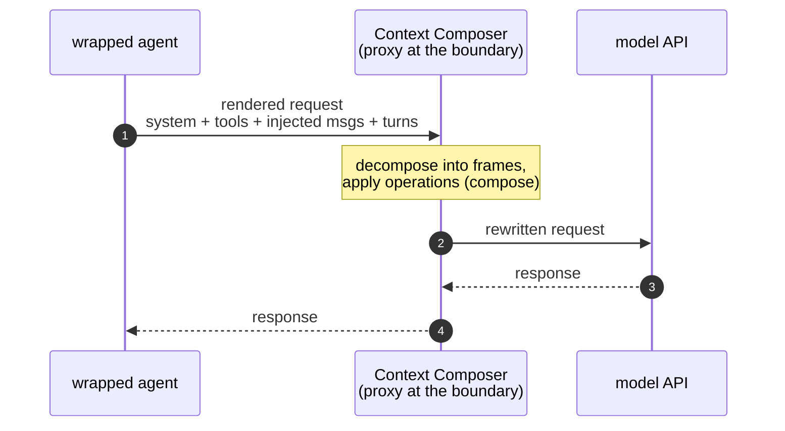
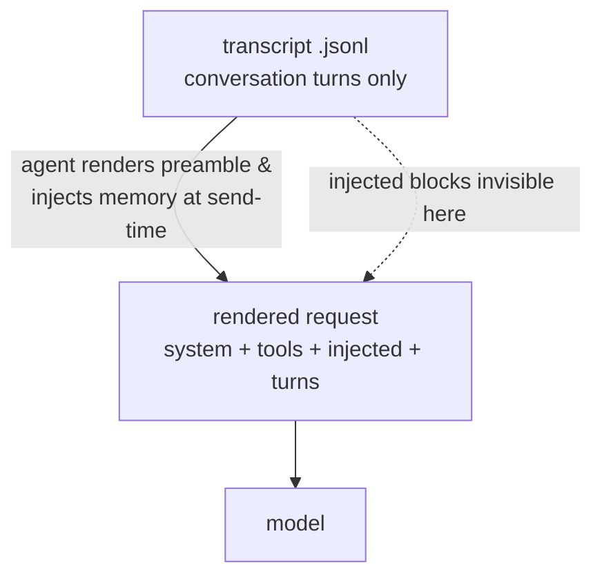

# Context Composer — Design Document

*Semantic Frame Context Management System*

> Status: design draft. Background material: [`raw_transcript.md`](./raw_transcript.md).

---

## 1. Summary

**Context Composer** reimagines LLM context as a sequence of composable **semantic
frames** rather than a flat, append-only token stream. Instead of accepting whatever
accumulates in the window during a conversation, the user (or an agent) can
**surgically manipulate** that context: delete tangents, compact stale turns, strip
noisy tool output, combine related turns, branch, and offload to external memory —
all while a real LLM keeps running the conversation against the mutated state.

Three properties define the system:

1. **Frames** — the context is segmented into semantic units you can address and operate on.
2. **A rich operation toolkit** — not just "compact the whole thing," but a broad set of targeted operations on individual frames or groups.
3. **Git-style versioning** — every operation is a commit; full history, rollback, and branching apply to *context itself*.

The deliverable is a **portfolio demo** that makes the paradigm tangible and starts a
conversation about context architecture. Practicality matters only insofar as the
mechanism is *theoretically grounded* (see [§9](#9-provider-assumptions--constraints)).

### 1.1 Positioning (the one-line identity)

The core, differentiating idea is **live, in-conversation, model-unaware surgery on
the active working window at the turn/frame level.** The running model never sees the
operations — only the resulting context. This is context engineering performed
*during* a task on the *live* window, distinct from tools that assemble and version a
persistent knowledge/memory base *before/around* a task.

---

## 2. Core Concepts

### 2.1 Frame

A **frame** is a semantic unit of conversation — the addressable object the whole
system operates on.

- **Default extraction:** each user turn and its corresponding assistant turn form a
  frame. **All of the assistant turn's tool calls and their results are bundled into
  the same frame** — tool calls are *not* their own frames.
  *(Rationale: splitting on tool-call boundaries produces meaningless fragments — e.g.
  a 3-word "and now let me check this repo" frame wedged between two tool calls.
  Keeping the assistant turn whole keeps frames semantically coherent. Nesting
  frames-within-frames is rejected: the model is **flattened**.)*
- **Granularity is a starting point, not a commitment.** Rather than trying to get
  boundaries perfect upfront, the system gives you operations (`combine`, `split`) to
  reshape frames after the fact. This is the central design bet.
- Each frame carries: an **auto-generated title**, an **auto-generated summary** (for
  scanning in frame view), the **full text**, and metadata (see [§7](#7-data-model)).
- **Sub-agent calls** are treated exactly like tool calls: the assistant invokes a
  sub-agent, gets a result back within its turn, and it all stays in the same frame.
  Sub-agents are *not* separate conversation trees.
- **Large pasted blobs are not auto-split.** A big file pasted into a turn stays inside
  that turn's frame; the user reshapes it on demand with `split` or `offload`. This
  keeps extraction dumb-and-simple and is consistent with the reshape-after-the-fact bet
  above — no size heuristics at creation time.
- **The system prompt is itself a frame** — captured like any other, no special type.
  See [§2.7](#27-everything-the-model-receives-is-a-frame).

### 2.2 Operation

An **operation** is a transformation applied to one or more frames (or to the branch
structure). Operations are the heart of the product — see the exhaustive catalog in
[§5](#5-operation-catalog-the-core).

### 2.3 Git-style versioning

Every mutating operation is a **commit**. The system keeps the full revision history
of the context, enabling rollback to any prior state, branching from any point, and
cherry-picking frames across branches and conversations. Context is treated like a
Git repository whose "files" are frames.

### 2.4 Branching

Context can fork into a tree of branches from any frame. Two semantics are supported,
chosen per operation:

- **Shared-ancestor frames** — an operation on a shared frame ripples forward to all
  descendant branches.
- **Isolated frames** — branch-specific; changes don't affect other branches.

So when you operate on a past frame, **you choose per operation** whether the change
ripples forward to descendant branches.

Two related scope boundaries:
- **No git-style branch merge.** Combining two *frames* is
  [`combine`](#5b-structural-operations); combining two *branch histories* is out of
  scope (see [future work](#10-future-work)).
- **Cross-branch combination is only via explicit `import`** — see
  [§5.F](#5f-composition--runtime). Branches are isolated timelines; `import`
  (cherry-pick) is the single bridge between them.

### 2.5 External memory

Frames are **always persisted durably** the moment they're created (for session
resume — same as Isomux saving every message). Separately, an explicit **offload**
operation swaps a frame's full text *in the active context* for a **summary + file
reference**, freeing window space while keeping the content reachable on demand. The
data already exists in storage; offload only changes how the frame is *represented* in
the working context.

**Retrieval needs no special mechanism.** The offload stub carries the
file path, and — assuming the agent has a file-read tool ([§9](#9-provider-assumptions--constraints)) —
the model simply **reads the file** when it needs the content; no custom fetch tool, no
heuristic intent-detection. When it does, the content re-enters the conversation as a
normal **file-read tool-result frame**, which is itself a fully manageable frame (you
can re-`offload`/`compact` it). A user-facing `restore` exists only as a convenience for
putting content back inline without a model round-trip.

### 2.6 The model is unaware (key principle)

When the user performs an operation, the **running LLM does not see the operation** —
it only ever sees the resulting mutated context. From the model's perspective, the
context simply *is* whatever it now is. The operation history is **metadata for the
user, not signal for the model.** ("We're doing surgery on its brain; it doesn't know
what's going on.")

### 2.7 Everything the model receives is a frame

There are **no frame types.** Every frame is uniform and supports the same operations; a
frame is just an addressable chunk of context. What it *holds* varies — a conversation
turn, the system prompt, a block of tool definitions, a chunk of agent-injected memory —
but none of those are special classes.

Frames cover the **entire context the model receives**, not only the conversation. The
non-conversational preamble — system prompt, tool definitions, and **anything the agent
injects** (project instructions, retrieved memory, …) — is captured as frame(s) at the
head of the list. Turns are frames; the preamble is frames; it is all one uniform list.

**Total control, by capture — not by constraint.** Context Composer is *unopinionated
about what enters* the context: it does not seal, disable, or restrict the agent's
injectors. It captures **everything the model actually receives** as frames and lets you
manipulate any of it — keep, compact, edit, offload, or delete. *"What's necessary and
nothing but that"* is achieved by your surgery on the complete realized context, not by
policing its sources. (Same reshape-after-the-fact bet as [§2.1](#21-frame), applied to
provenance.)

A preamble frame is **just a frame** — no pinning, no guard rails. You can compact it,
offload it (a strong demo beat — live token reclamation), or delete it outright; deleting
it strips the model's scaffolding, and that is your call to make, not the tool's.
Capturing the complete realized context requires observing it at the right layer — see
[§9](#9-provider-assumptions--constraints) and
[Appendix B](#appendix-b--reference-implementation-notes).

---

## 3. Architecture: CLI-first, UI as a thin wrapper

The **CLI is the core API**; the UI is a wrapper that calls the same commands. This
keeps logic decoupled from presentation, makes every operation scriptable and
testable independently, and means the UI can never do something the CLI can't.

```
┌──────────────────────────────┐      ┌──────────────────────────────┐
│            UI                │      │       External scripts        │
│  (conversation ⇄ frame view) │      │      / agents / tests         │
└───────────────┬──────────────┘      └───────────────┬──────────────┘
                │  invokes                              │  invokes
                ▼                                       ▼
        ┌───────────────────────────────────────────────────┐
        │            ctx CLI  (core operation API)           │
        │  list · show · add · delete · combine · split     │
        │  edit · compact · strip · summarize · offload     │
        │  restore · import · branch · checkout · revert    │
        │  tag · history · diff · status · compose · send    │
        └───────────────────────┬───────────────────────────┘
                                 ▼
        ┌───────────────────────────────────────────────────┐
        │  Engine: frame store · commit graph · composer     │
        └───────────────────────┬───────────────────────────┘
                                 ▼
        ┌──────────────────────┐   ┌──────────────────────────┐
        │  Durable frame store  │   │  LLM / agent runtime     │
        │  + external memory    │   │  (see §9 assumptions)    │
        └──────────────────────┘   └──────────────────────────┘
```

Each CLI command emits JSON (machine-readable for the UI/scripts) or plain text.

> **Implementation note (not design surface):** the reference prototype realizes the
> backend by wrapping an existing coding agent — Claude Code, driven via its SDK. It
> manages the message history the agent sees and reuses the agent's **native
> facilities** rather than reimplementing them: tools, sub-agents (its Task tool),
> permissions, and the file-read tool that powers offload retrieval
> ([§5.D](#5d-memory-operations)). This is an implementation choice, not part of the
> design — any runtime satisfying the assumptions in
> [§9](#9-provider-assumptions--constraints) would work. See
> [Appendix B](#appendix-b--reference-implementation-notes) for how the prototype owns
> and mutates that history.

---

## 4. Two views

A single conversation is presented through two interchangeable views, toggled at any time.

- **Conversation view** — standard ChatGPT-style chat. This is where you *talk to the
  model*. Questions the model asks, tool calls, etc., pass through as plain text/turns
  (no special permission or question widgets — see [§9](#9-provider-assumptions--constraints)).
- **Frame view** — the manipulation surface. Frames are shown as a **Git-style tree**:
  nodes are frame states (title + summary), edges are the operations that transformed
  them. You expand a node for full text, right-click for the operation menu, drag to
  branch. A side panel shows the operation/commit history and filters by type.

---

## 5. Operation Catalog (the core)

This is the exhaustive list of operations. They fall into six groups:

- **A. Read / navigation** — non-mutating; no commit.
- **B. Structural** — change the *set/order* of frames; each is a commit.
- **C. Content** — change a frame's *contents*; each is a commit.
- **D. Memory** — move content between active context and external storage.
- **E. Version control** — operate on the commit graph / branches.
- **F. Composition / runtime** — assemble and send context to the model.

> **Commit rule:** every operation in groups B, C, D (and the structural VC ops in E)
> produces a commit `{ id, type, affectedFrameIds, params, timestamp, note }`.
> Group A produces none. Composition ([§5.F](#5f-composition--runtime)) is
> non-mutating to history but determines what the model receives.

### Quick reference

| Op | Group | One-liner |
|---|---|---|
| `list` | A | List frames in the current state |
| `show` | A | Show a frame's full content |
| `history` | A | Show the commit log |
| `diff` | A | Compare two frames/commits/branches |
| `status` | A | Active branch, HEAD, pending state |
| `add` | B | Create a new frame manually |
| `delete` | B | Remove a frame from active context |
| `combine` | B | Merge ≥2 frames into one |
| `split` | B | Split one frame into several |
| `move` | B | Reorder a frame in the sequence |
| `import` | B | Cherry-pick a frame from another branch/conversation |
| `edit` | C | Manually replace a frame's text |
| `compact` | C | LLM-summarize a whole frame to cut tokens |
| `strip` | C | Remove specific tool-call results inside a frame |
| `summarize` | C | LLM-summarize tool results / sub-parts inside a frame |
| `retitle` | C | (Re)generate or set a frame's title/summary |
| `offload` | D | Swap full text for summary + file reference |
| `restore` | D | Re-inject an offloaded frame's full text |
| `branch` | E | Create a branch from a frame/commit |
| `checkout` | E | Move HEAD to a branch or commit |
| `revert` | E | Roll back to a previous commit |
| `tag` | E | Name a checkpoint state (optional) |
| `compose` | F | Build the exact context payload for the next call |
| `send` | F | Run the next model turn against composed context |

---

### 5.A Read / navigation (non-mutating)

**`list`** — List all frames in the current branch state, with index, id, title, token
estimate, and flags (offloaded?, edited?, compacted?). The scan view for frame mode.

**`show <frame>`** — Display a single frame's full text, summary, and metadata
(linked tool calls, file reference if offloaded, provenance).

**`history [--frame <id>] [--type <op>]`** — Show the commit log: every operation,
its type, affected frames, timestamp, note. Filterable by frame or operation type.

**`diff <a> <b>`** — Compare two states: two commits, two branches, or a frame before
and after an operation. Powers the side-by-side previews in frame view.

**`status`** — Current branch, HEAD commit, current frame position, count of
offloaded frames, and any uncommitted/pending changes.

---

### 5.B Structural operations

**`add [--text <t>] [--at <pos>]`** — Manually create a new frame, either from pasted
text or empty for editing. Use cases: inject an instruction/note, seed context, or
paste content the conversation didn't produce.

**`delete <frame...>`** — Remove one or more frames from the active context. The
canonical use case: prune a tangent so the model stops attending to noise. The frame
remains in durable storage and history (recoverable via `revert`); it's just no longer
in the composed window.

**`combine <frame...> [--summarize]`** — Merge multiple frames into a single frame.
Canonical use case: collapse five iterations of a code file into one "previous
attempts" frame (optionally `--summarize` to compact while merging). Reduces
fragmentation and the model's burden of tracking which version is current.

**`split <frame> --at <marker|index>`** — Split one frame into several. The inverse of
`combine`; lets you separate out a sub-part you want to manipulate independently
(e.g., peel a distinct topic off a long turn).

**`move <frame> --to <pos>`** — Reorder a frame within the sequence ("rearrange
blocks"). Note the caching cost (see [§9](#9-provider-assumptions--constraints)):
moving early frames invalidates the tail.

**`import <source> <frame...>`** — Cherry-pick frames from **another conversation or
branch** into the current branch. The Git analogy made literal: cross-repo cherry-pick
for context. Source can be another session, a sub-agent branch, or a search across all
conversations.

---

### 5.C Content operations

**`edit <frame> [--text <t>]`** — Manually replace or modify a frame's text, giving
the user full authorship over what the model sees. Tracked as an `edit` commit.
*Semantics:* editing keeps `createdAt` **immutable** (it marks when the
frame entered the conversation — relevant to ordering and caching) and bumps
`modifiedAt`; it is **non-destructive downstream** — later frames are not regenerated,
only what the next `compose`/`send` uses changes (the cache cost is paid at next
`send`). Diffs render as a standard text diff (`fullText` before vs after) in the
history panel. *(UX nudge: prefer editing recent frames — see
[§9](#9-provider-assumptions--constraints).)*

**`compact <frame>`** — Use the LLM to **summarize an entire frame** down to its
essence ("user asked X, assistant explained Y") while preserving its semantic
contribution. This is *frame-level compaction* — the key insight that compaction
should be granular and targeted, not an all-or-nothing operation on the whole window.

**`strip <frame> [--result <id...>|--all-results]`** — Remove specific tool-call
**results** inside a frame without deleting the frame. Canonical use case: an assistant
turn made three API calls with long outputs; keep the reasoning, drop the raw output
bloat.

**`summarize <frame> [--results|--range ...]`** — LLM-summarize a *part* of a frame
(e.g., compress long tool results in place) rather than the whole frame. The
finer-grained sibling of `compact`/`strip`.

**`retitle <frame> [--title <t>] [--summary <s>] [--regen]`** — Set or regenerate a
frame's title/summary. Titles/summaries are auto-generated on creation; this lets the
user correct them or refresh after edits.

> **Why so many content ops?** There isn't a single `compact` primitive — there's a
> *rich toolkit* for reshaping the part of the context you care about. `compact`,
> `strip`, `summarize`, `edit`, `combine`, `split` are all facets of "reshape this
> region of context to be exactly as useful as it needs to be."

---

### 5.D Memory operations

**`offload <frame>`** — Replace a frame's full text *in the active context* with a
**reference**: a short note ("here was a chunk where the user discussed X — summary:
…; full content in `frames/<id>.md`") plus the file path. Frees window tokens while
keeping content reachable. *(The frame's data is already persisted; offload only
changes its representation in the working context. It is opt-in / on-demand, not
automatic.)* The model retrieves it on demand by **reading the file with its file-read
tool** — the stub gives it the path. No custom fetch tool, no intent-guessing.

**`restore <frame>`** — Re-inject a previously offloaded frame's full text inline. This
is a **user convenience only**; the *model* doesn't need it, since it can just read the
offloaded file directly. Note that when the model reads an offloaded file, the content
re-enters the conversation as a normal **file-read tool-result frame** — itself a fully
manageable frame you can re-`offload`/`compact`.

**`persist` (automatic, not a user command)** — Every frame is written to durable
storage on creation, so a user can close the tab and resume later. This underpins
both session resume and the offload/restore mechanism (offload is cheap precisely
because the data is already saved).

---

### 5.E Version-control operations

**`commit` (implicit)** — Every mutating operation records a commit
`{ id, type, affectedFrameIds, params, timestamp, note }`. There is no separate manual
commit step in the default flow; the operation *is* the commit.

**`branch <name> [--from <frame|commit>]`** — Fork a new branch from any frame or
commit. Use cases: explore an alternative direction while keeping the original intact;
test prompt/strategy variations side by side.

**`checkout <branch|commit>`** — Move HEAD to a branch or a past commit, switching the
active context to that state.

> **No branch `merge` (out of scope).** Git-style branch merging — combining two
> *histories* with conflict resolution when shared-ancestor frames diverge — is
> deferred to [future work](#10-future-work). Merging two *frames* is
> [`combine`](#5b-structural-operations); pulling frames across branches is
> [`import`](#5b-structural-operations).

**`revert <commit>`** — Roll the active context back to a previous commit state.
Nothing is lost — you can move forward again or branch from the reverted point.

**`tag <name> [--at <commit>]`** *(optional)* — Name a checkpoint for easy reference
("good-baseline", "pre-refactor").

---

### 5.F Composition / runtime

**`compose [--branch <b>]`** — Build the **exact context payload** that will be sent
to the model, by walking the active branch path to HEAD and resolving every frame's
current representation: deletions omitted, compactions/edits applied, offloaded frames
rendered as references. This is where the abstract frame graph becomes a concrete
prompt. Output is inspectable (you can see precisely what the model will receive).

- **Branch selection:** `compose` **always walks a single branch path**
  to HEAD. Cross-branch combination is done *only* via explicit
  [`import`](#5b-structural-operations)/cherry-pick (a real commit) — never by composing
  across branches. This keeps provenance honest (everything in the payload literally
  exists on the active branch) and preserves the model-unaware principle. Native
  multi-branch compose is [future work](#10-future-work).

**`send [--text <t>]`** — Issue the next model turn: `compose` the context, append the
new user input, hand it to the backend, and capture the response as a new frame. The
model sees only the composed (mutated) state — never the operation history.

---

## 6. Worked use cases

1. **Tangent pruning.** You wander off-topic. Switch to frame view, `delete` the
   tangent frames. The next turn flows cleaner; the model never re-reads the noise.
2. **Code iteration cleanup.** Five versions of a file sit in context. `combine` the
   old ones into a "previous attempts" frame, optionally `compact` it. Context now
   holds the current version + a pointer to what was tried.
3. **Tool-call spam.** An assistant turn made three calls with huge outputs. `strip`
   two results and `summarize` the third; reasoning stays, bloat goes.
4. **Branch to explore.** `branch` from an earlier frame, try a different direction,
   keep the original. Later `import` the best frames from one branch back into another.
5. **Offload to external memory.** A big but maybe-needed frame: `offload` it to a
   file; the window keeps a summary + path; the model reads the file with its native
   tool if it needs the detail (or you `restore` it manually).
6. **Cross-conversation reuse.** Found a great explanation in another chat? `import`
   that frame into the current branch — cherry-pick across "repos."

---

## 7. Data Model

```
Frame {
  id            : string
  title         : string          // auto-generated, user-overridable
  summary       : string          // auto-generated, for frame-view scanning
  fullText      : string
  role          : "user" | "assistant" | "system" | "imported"
  toolCalls     : ToolCall[]      // bundled with the assistant turn; flattened
  tokenEstimate : int
  createdAt     : timestamp
  modifiedAt    : timestamp
  branchId      : string
  parentFrameId : string | null
  isOffloaded   : bool
  fileReference : string | null   // path when offloaded
  provenance    : OpRef[]         // operations that produced this frame state
}

Operation /* = Commit */ {
  id              : string
  type            : "add" | "delete" | "combine" | "split" | "move" |
                    "import" | "edit" | "compact" | "strip" | "summarize" |
                    "retitle" | "offload" | "restore" | "branch" |
                    "checkout" | "revert" | "tag"
  affectedFrameIds: string[]
  params          : object        // op-specific (e.g., split marker, summarize range)
  timestamp       : timestamp
  note            : string | null
  branchId        : string
  parentCommitId  : string | null
}

Branch {
  id            : string
  name          : string
  headCommitId  : string
  parentBranchId: string | null
  createdAt     : timestamp
}

Session {
  id              : string
  activeBranchId  : string
  headFramePos    : int
  externalMemRefs : string[]
  pendingChanges  : bool
}
```

---

## 8. UI Architecture

- **Dual view** with a toggle: conversation view ⇄ frame view.
- **Frame view = Git-style tree.** Nodes = frame states (title + summary, color-coded
  by branch); edges = operations (labeled with op type). Click a node → expand full
  text; right-click → operation menu; drag → create a branch.
- **Preamble frame(s)** at the head of the tree (system prompt / tool definitions /
  agent-injected context) — operable like any other frame, `delete` included.
- **Frame details panel** — full text with inline edit, summary, linked tool calls,
  file reference if offloaded, and provenance.
- **Operation/history panel** — the commit log with filtering and side-by-side diffs;
  click a commit to `checkout`/`revert`.
- **Tree visualization** — start minimal (hand-drawn SVG nodes/edges) for control and
  cleanliness; graduate to Cytoscape.js / Vis.js if the tree gets large. For a demo,
  minimal usually looks cleaner than a heavy library.

---

## 9. Provider assumptions & constraints

**Assumptions about the LLM backend:**

1. Messages have a standard structure: user / assistant (with optional tool calls and
   results) / system.
2. Tool calls are discrete, inspectable units within an assistant message — not opaque
   blobs. *If this holds*, tool calls are first-class within frames (enabling `strip`
   / `summarize` on individual results); *if not*, they degrade gracefully to plain
   text.
3. The API supports **editing an earlier message and re-running from that point** —
   which Claude and ChatGPT both already do. Context Composer's frame editing is just
   leveraging this existing capability; it asks for **nothing new** from the provider.
4. The full message structure is readable, not just rendered text.
5. The agent has a **file-reading tool**, so an offloaded frame can be retrieved by the
   model simply reading its file on demand ([§5.D](#5d-memory-operations)) — no bespoke
   fetch mechanism needed.
6. The **system prompt is composable** by the harness (not a fixed opaque preamble), so
   it can be represented and operated on as a frame
   ([§2.7](#27-everything-the-model-receives-is-a-frame)).
7. The **complete rendered context can be observed and rewritten before each call** —
   every block the model actually receives (system, tools, agent-injected content, and
   the conversation), not just the transcript. This is what makes total control
   ([§2.7](#27-everything-the-model-receives-is-a-frame)) achievable; see
   [Appendix B](#appendix-b--reference-implementation-notes).

**Caching / efficiency:**

- Editing a frame keeps everything **before** it cached (prefix caching) but
  **re-tokenizes everything after** it. So edits near the *end* of the context are
  cheap; edits to *early* frames invalidate the tail.
- **UX consequence:** nudge users to edit/operate on **recent** frames and let early
  frames "settle" into stable context. Keep the tail hot, the head stable.
- **Composer cache duties (it owns the exact request bytes — see
  [Appendix B](#appendix-b--reference-implementation-notes)):** (a) serialize unchanged
  frames **deterministically** — identical bytes and key order every turn — so it never
  busts the cache by accident; (b) keep the provider's cache-prefix markers (e.g.
  `cache_control`) on the **stable head**, above the large tool + system block, so that
  high-value prefix is cache-read rather than reprocessed each turn.
- For a demo, full re-tokenization on each mutation is acceptable and honest — nobody
  is watching inference cost. The pitch is "here's the UX we want; here's how a
  provider *could* support it efficiently," not "we solved the infra."

**Scope simplifications (demo):**

- **No permission system.** Run with permissions effectively skipped
  (`--dangerously-skip-permissions`-style). Optionally a single global "ask before
  tool calls" toggle, but no full permission UI.
- **No special question/planning widgets.** If the model asks the user something, it
  appears as plain text in conversation view; the user answers as the next turn. No
  bespoke interaction UI — this avoids the "adapter hell" of replicating every native
  agent feature.

---

## 10. Future work

- **Smarter frame extraction.** Use the LLM to detect true semantic boundaries and
  auto-merge/split, instead of the default turn-based segmentation.
- **Cross-branch composition** as a first-class compose mode.
- **Git-style branch merge** with frame-level conflict resolution.
- **Auto-restore on detected intent** — heuristically re-inject an offloaded frame when
  the model's output implies it's needed.
- **Collaboration.** Shared contexts, visible operation history, suggested operations,
  rollback by others.
- **Agentic operations.** The model itself proposes operations ("this tangent should
  be compacted") that the user accepts/rejects — surfacing agentic reasoning *about
  context*. A strong demo beat.
- **Deeper feature parity** with native agent systems (planning, permissions) once the
  core is stable.

---

## 11. Implementation Plan

Tracer-bullet sequencing: each phase is the smallest end-to-end slice that produces
observable behavior, smallest first — no horizontal layers (no "build all the ops, then
build the UI"). Tech stack is TypeScript end-to-end on Bun to match the Isomux codebase
(proxy/engine + CLI + React UI).

### Decisions (open questions, answered with current leaning)

- **Storage substrate → JSON-on-disk**, with deterministic *canonical* serialization
  from birth (one serializer feeds both the cache story and the store). SQLite is
  deferred to a later optimization only if history queries get annoying.
- **Process model → long-lived proxy daemon** that holds the authoritative frame state,
  exposing a small local control API the CLI calls. The CLI mutates the same live state
  the proxy uses for the next request — it does **not** coordinate with the proxy through
  disk alone.
- **Multi-turn tool-loop validation → carried explicitly by Phase 1**, not deferred to a
  separate spike (the boundary spike validated a single rewrite, not the full loop).
- **Genuinely uncertain:** whether shared-vs-isolated *ripple* is needed for the demo.
  The locked decision is *single-branch compose*, not full ripple — so ripple is split
  out and gated (Phase 4b).

### Phase 1 — Tracer bullet: prove the engine loop end-to-end

- **Goal:** one rewritten request round-trips the full loop with a `delete` applied,
  reconciliation working, and a byte-stable head.
- **Vertical slice:** proxy daemon at the rendered-context boundary (`ANTHROPIC_BASE_URL`)
  captures `/v1/messages` → decompose into preamble frame(s) + turn frames → reconcile the
  incoming request against the authoritative in-memory frame state (match known frames,
  append new ones) → CLI `list`/`show`/`delete` mutates that live state via the control
  API → `compose` walks frame state → canonical serializer rewrites the body
  (`cache_control` on the stable head) → forward → capture response as a new frame.
- **Files/modules:** `proxy/` (http daemon + control API), `engine/decompose`,
  `engine/reconcile`, `engine/compose`, `engine/serialize` (canonical), `engine/state`
  (in-memory), `cli/` (`list`/`show`/`delete`/`compose` + control-API client). `compose`
  exposes `--dump` (print the resolved payload) and `--hash-head` (print a hash of the
  serialized stable head) so determinism is checkable, not eyeballed.
- **Acceptance:**
  - Point the wrapped agent at the proxy; one prompt yields a captured request and
    `ctx list` shows preamble + turn frames.
  - `ctx delete <frame>`; the next turn's rewritten request omits it and the model's
    answer reflects the mutated context (model unaware).
  - **Reconciliation:** a second user turn after the delete **plus at least one
    tool_use/tool_result round-trip** — known frames are matched, new frames appended, the
    deleted frame stays gone when recomposed.
  - **Inspectable compose:** `ctx compose --dump` prints the exact payload the next send
    will use (deletions omitted) — this is the inspection command later phases rely on, so
    every "compose shows X" acceptance downstream is observable.
  - **Determinism:** across two consecutive sends with no head change, `ctx compose
    --hash-head` prints the **same hash** both times (byte-identical stable head) and the
    dumped payload still carries the `cache_control` marker on that head.
- **Risks/unknowns:** frame identity/reconciliation across turns is the crux of full
  ownership; streaming responses are SSE passthrough; the tool-loop under full ownership
  is the remaining load-bearing unknown this phase exists to de-risk.
- **Size:** M (the load-bearing phase — budget accordingly).

### Phase 2 — Versioning spine (narrow vertical slice)

- **Goal:** every mutating op is a durable, inspectable, undoable commit — for the tracer
  ops only.
- **Vertical slice:** persist frame state + commit graph to JSON-on-disk (the canonical
  form from Phase 1); record an implicit commit when a **user mutating op** (`delete`)
  happens; wire `history` and `revert`. Frame **capture** of new turns is a *session-ingest
  event* (the automatic `persist` of §5.D — written for resume), **not** a user commit, so
  the §5/§7 operation enum stays intact and `history` shows only user operations.
- **Files/modules:** `engine/store` (json-on-disk), `engine/commit-graph`,
  `cli/` (`history`, `revert`), `engine/state` (durable-backed).
- **Acceptance:** restart the proxy/CLI → `ctx list` shows the persisted frames →
  `ctx delete` one → `ctx history` shows the implicit commit → `ctx revert` restores it →
  the next rewritten request reflects the reverted state.
- **Scope guard (anti-horizontal):** durable store + commit graph for the tracer ops
  only — **no** generalized migrations, indexing, or query APIs.
- **Risks/unknowns:** the commit model must be right early — provenance, undo semantics,
  and the op-API shape all drift if commits arrive after op-breadth (§5 makes every
  mutating op a commit by definition).
- **Size:** M.

### Phase 3 — Operation breadth (a sequence of vertical op slices)

- **Goal:** grow the §5 toolkit, each op demoable end-to-end through proxy rewrite — not a
  batch "all ops" drop.
- **Vertical slices (land in order; each = a commit type + CLI verb + compose handling):**
  - **3a** `edit`, `compact` — content authorship + frame-level compaction (high demo value).
  - **3b** `offload`, `restore` — validates file-read retrieval (assumption 5); the live
    token-reclamation beat.
  - **3c** `combine`, `split`, `move`, `add` — structural reshaping.
  - **3d** `strip`, `summarize`, `retitle` — sub-frame content ops.
- **Files/modules:** `engine/ops/*` (one module per op), `cli/` (verbs),
  `engine/compose` (per-op resolution), `engine/llm` (compact/summarize/title generation).
- **Acceptance (per slice):** apply the op via CLI; `ctx compose --dump` shows the resolved
  payload; the next send reflects it; `ctx history` records the commit. Concrete per-slice
  checks (so "next send reflects it" is never ambiguous):
  - `edit`/`compact`: `ctx edit <frame> --text ...` → `compose --dump` shows the
    replacement text; `ctx compact <frame>` → `compose --dump` shows the summary in place
    of the full text; head-hash unchanged when the frame is in the tail.
  - `offload`: `ctx offload <frame>` → `compose --dump` shows the stub + file path (not the
    full text) and the frame's token estimate drops; the wrapped agent reading that path
    yields a new tool-result frame.
  - `strip`/`summarize`/`retitle`: `ctx strip <frame> --result <id>` → `compose --dump`
    shows that tool result gone while the turn's reasoning remains; `ctx summarize <frame>
    --results` → the result is replaced by a shorter summary in the dump; `ctx retitle
    <frame> --regen` → `ctx list` shows the new title/summary (composed payload unchanged).
  - `combine`/`split`/`move`/`add`: `compose --dump` shows the new frame set/order.
- **Scope guard (anti-horizontal):** each op is independently shippable/demoable; resist
  landing them as one undifferentiated layer.
- **Risks/unknowns:** LLM-backed ops (`compact`/`summarize`/`retitle`) need
  deterministic-enough output to not gratuitously bust the cache; `offload` depends on the
  agent's file-read tool + a reachable path.
- **Size:** L (split across 3a–3d).

### Phase 4 — Branching

- **4a — basic branching (M).**
  - **Goal:** fork / inspect / cherry-pick context across branches with single-branch
    compose.
  - **Vertical slice:** `branch`, `checkout`, `import` with **branch-local** frame states;
    `compose` always walks one branch path to HEAD (the locked decision); `diff`/`status`
    report active branch + HEAD.
  - **Files/modules:** `engine/branch`, `engine/commit-graph` (multi-branch),
    `cli/` (`branch`/`checkout`/`import`/`diff`/`status`), `engine/compose` (single-path walk).
  - **Acceptance:** `ctx branch alt` from a frame → `ctx checkout alt` → mutate
    independently → original branch unaffected → `ctx import <branch> <frame>` cherry-picks
    a frame in as a commit → `compose` walks only the active branch.
- **4b — shared-vs-isolated ripple (conditional, M).**
  - **Goal:** an op on a shared-ancestor frame ripples forward to descendant branches.
  - **Gate:** build **only if the demo needs it** — the locked decision is single-branch
    compose, not full ripple semantics in the first branch slice.
  - **Files/modules:** `engine/branch` (ripple propagation across descendants),
    `engine/compose` (descendant re-resolution), `cli/` (`--shared`/`--isolated` flag on the
    mutating ops).
  - **Acceptance:** edit a shared-ancestor frame with `--shared` → the change appears when
    composing **each** descendant branch; the same edit with `--isolated` (default) → only
    the active branch changes, descendants compose unchanged.
- **Risks/unknowns:** branching multiplies the state space; ripple is the hidden
  complexity — deliberately split out and gated.
- **Size:** 4a M, 4b M.

### Phase 5 — Dual-view UI (thin wrapper)

- **Goal:** conversation ⇄ frame-tree views, calling the *same* engine control API the CLI
  does — no second operation client.
- **Vertical slice:** React shell; conversation view (chat over `send`); frame view as a
  hand-drawn **SVG git-tree** (nodes = frame states, edges = ops); details panel (full
  text/summary/provenance/file ref); history panel (commit log + diff, click to
  `checkout`/`revert`). The UI invokes the engine/control API only.
- **Files/modules:** `ui/` (React app) over the existing control API; no new engine logic.
- **Acceptance:** toggle conversation ⇄ frame view; right-click a frame → run an op → both
  views update. **CLI parity is enforced mechanically:** every UI op dispatches through a
  shared op registry / control-API route the CLI uses too (the proxy logs the route per UI
  action); the UI surfaces **no** operation lacking a CLI verb — verifiable by diffing the
  UI's op menu against the CLI verb list.
- **Why here:** the tree view wants commits + branches to already exist; an earlier full
  UI means rework. A thin conversation-only inspector (rendering `ctx list`/`show`) is
  acceptable earlier if momentum demands it, but the real dual-view lands here.
- **Risks/unknowns:** keeping React strictly a wrapper (no logic leak); SVG tree layout at
  scale (graduate to Cytoscape/Vis only if the tree gets large).
- **Size:** L.

### Phase 6 — Demo polish + blog

- **Goal:** three money shots scripted, plus a write-up.
- **Vertical slice:** (1) delete a tangent → cleaner next turn; (2) live preamble token
  reclamation — `offload`/`compact` the ~164 KB tool+system head, token count visibly
  drops; (3) branch to explore + `import` the best frame back. Polish, scripted
  walkthrough, blog post. *Note:* shot (2) **deliberately mutates the stable head** and
  pays the one-time cache-bust cost to show control/token reclamation — call this out in
  the write-up so it doesn't read as a violation of the "keep the head stable" caching
  guidance (§9); it's the exception that demonstrates the rule.
- **Files/modules:** `demo/` (scripts/fixtures), `blog/` (write-up), minor UI polish.
- **Acceptance:** each money shot runs start-to-finish in the UI; the blog draft explains
  the paradigm and the provider-efficiency framing from §9.
- **Risks/unknowns:** demo determinism under LLM variability — pin prompts/fixtures.
- **Size:** S/M.

---

## Appendix A — Glossary

- **Frame** — addressable unit of context (a conversation turn, or a chunk of the
  preamble); all frames are uniform — there are **no frame types**.
- **Preamble frame(s)** — frame(s) holding the non-conversational context (system prompt
  / tool definitions / agent-injected memory); uniform with all other frames — no special
  treatment.
- **Rendered-context boundary** — the actual request sent to the model (system + tools +
  injected blocks + turns); the layer where the complete context is observable and
  rewritable (see [Appendix B](#appendix-b--reference-implementation-notes)).
- **Operation** — a transformation on frames/branches; each mutating one is a commit.
- **Compose** — assembling the concrete context payload sent to the model.
- **Offload / Restore** — swap a frame for a reference to free window space / bring it
  back.
- **Shared vs isolated** — whether an operation on a frame ripples to descendant
  branches or stays branch-local.
- **Model-unaware principle** — the running model sees only the mutated context, never
  the operations.

---

## Appendix B — Reference implementation notes

*Implementation detail, not design surface — specific to the prototype that wraps
Claude Code (see [§3](#3-architecture-cli-first-ui-as-a-thin-wrapper)). A different
backend meeting the [§9](#9-provider-assumptions--constraints) assumptions could realize
these differently.*

### Interception at the rendered-context boundary

To control the *complete* realized context
([§2.7](#27-everything-the-model-receives-is-a-frame)) — including blocks the agent
injects downstream of the transcript — the prototype intercepts at the
**rendered-context boundary**: the actual request sent to the model. A small local proxy
(the agent is pointed at it via `ANTHROPIC_BASE_URL`) captures and rewrites each
`/v1/messages` payload before forwarding it.



**Spike-validated, both directions:**
- *Observe* — a one-word prompt produced a **174 KB** request: 3 system blocks, **76 tool
  definitions** (~164 KB), and a `messages` array with the user turn **plus an
  agent-injected `system`-role message** absent from the transcript.
- *Rewrite* — injecting a system override at the boundary ("begin reply with ZEPHYR")
  changed the model's output to `ZEPHYR ping`; the mutated context reached the model.

This is the *only* layer where everything the model sees is both visible and rewritable,
regardless of source. The transcript sits one level too high to see agent-injected
blocks:



**Caching caveat (sharp here).** The system + tool blocks (~164 KB above) sit at the
*front* of the request and serve as cache prefix; rewriting them busts the cache for
everything after. The [§9](#9-provider-assumptions--constraints) "keep the head stable,
edit the tail" guidance is a hard rule at this layer.

### Transcript layer (turn ↔ frame mapping)

The agent builds each request from a JSONL session transcript; its structure informs how
turns map to frames.
- **Not one line per turn.** The transcript is a `uuid` / `parentUuid` linked list with
  streaming partial fragments, empty assistant nodes, and housekeeping rows. Extraction
  must collapse these into one logical frame per turn; structural ops (`delete` / `move`
  / `combine`) must re-link the chain, not just drop list elements.
- **Transcript rewrite + resume works** at this layer (spike-validated: editing a turn
  changed the model's answer; deleting a re-linked turn removed it cleanly, model
  unaware) — but `stream-json` stdin injection did not, and the rendered-context boundary
  above is the more complete interception point.

**Full ownership of the outgoing request.** Each call, Context Composer **replaces** the
request body with the array composed from its own frame state — it does not patch what
the agent assembled. The wrapped agent is reduced to a model-runner + tool-executor, and
its own evolving transcript is irrelevant (overwritten every turn); this is what makes
total control hold. Owning the exact request bytes carries two cache duties — see the
caching note in [§9](#9-provider-assumptions--constraints).
